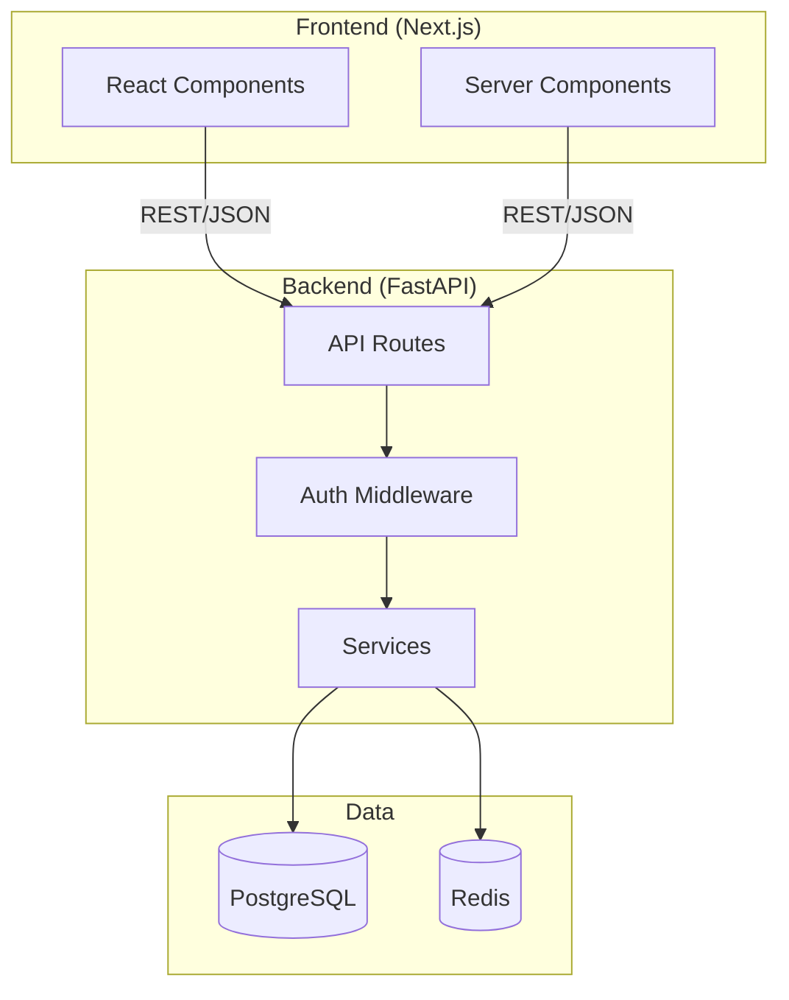
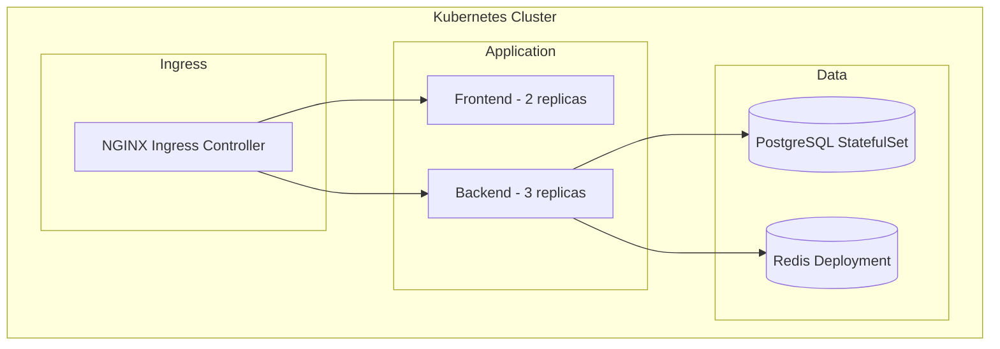
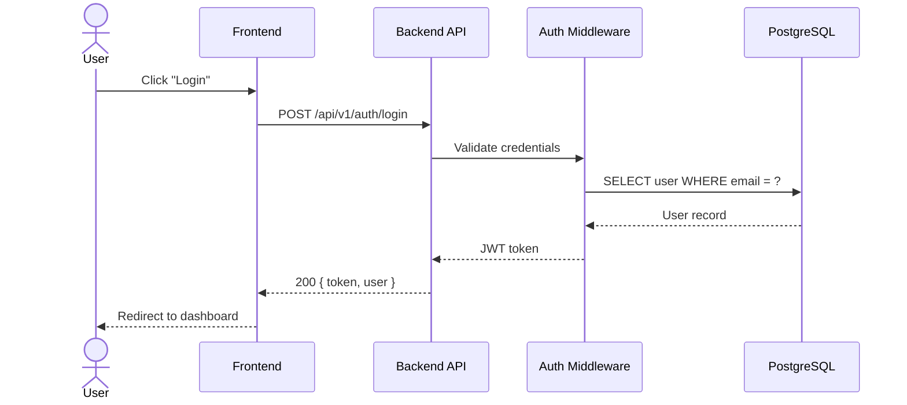
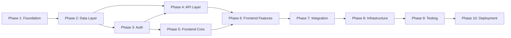
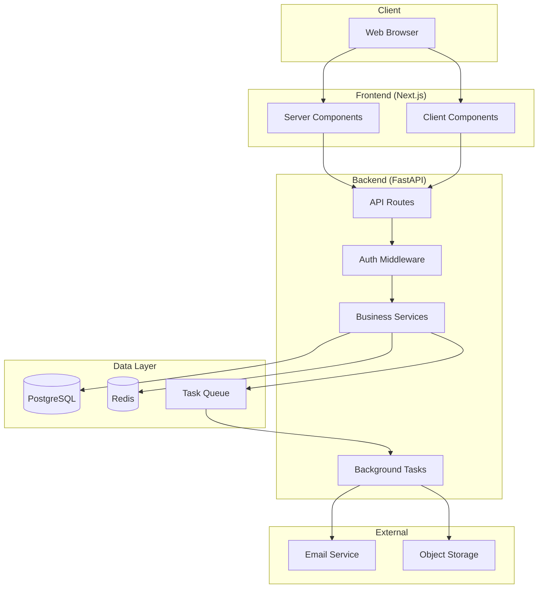
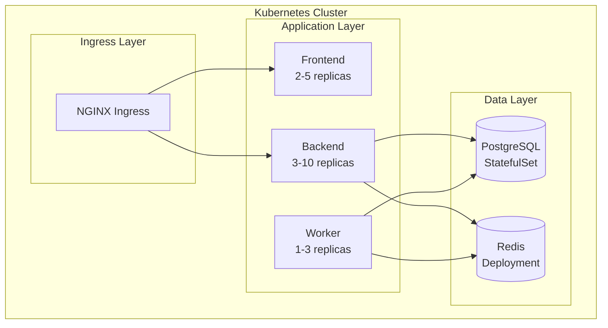
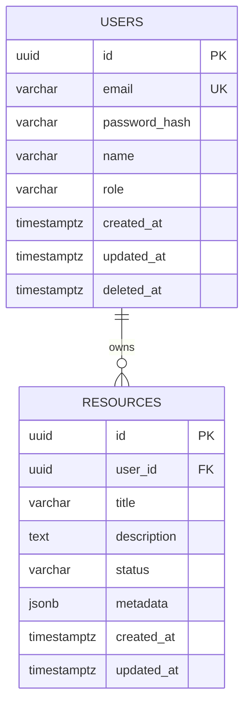
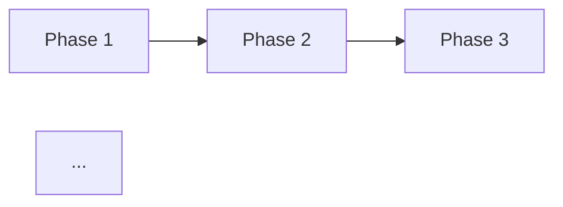

# Building with Claude: End-to-End SOP

> **A complete standard operating procedure** for taking an application from idea to production using Claude Code — with built-in drift prevention, progress tracking, and multi-repo coordination.

---

## Table of Contents

1. [How This SOP Works](#1-how-this-sop-works)
2. [Prerequisites & Environment Setup](#2-prerequisites--environment-setup)
3. [Phase 1 — Ideation & Brainstorming](#3-phase-1--ideation--brainstorming)
4. [Phase 2 — Requirements Engineering](#4-phase-2--requirements-engineering)
5. [Phase 3 — Architecture & System Design](#5-phase-3--architecture--system-design)
6. [Phase 4 — Detailed Design](#6-phase-4--detailed-design)
7. [Phase 5 — Implementation Planning](#7-phase-5--implementation-planning)
8. [Phase 6 — Implementation](#8-phase-6--implementation)
9. [Phase 7 — Testing & QA](#9-phase-7--testing--qa)
10. [Phase 8 — Deployment to Kubernetes](#10-phase-8--deployment-to-kubernetes)
11. [Phase 9 — Monitoring & Observability](#11-phase-9--monitoring--observability)
12. [Phase 10 — Go-Live & Verification](#12-phase-10--go-live--verification)
13. [Phase 11 — Maintenance & Operations](#13-phase-11--maintenance--operations)
14. [Phase 12 — Feature Additions](#14-phase-12--feature-additions)
15. [Appendices](#15-appendices)

---

## 1. How This SOP Works

### Phase Model Overview

This SOP defines 12 phases that take an application from a raw idea to a production system under active maintenance. Each phase has a clear purpose, produces specific artifacts, and has exit criteria that must be satisfied before moving forward.

```
┌──────────────────────────────────────────────────────────────────────────┐
│                        APPLICATION DELIVERY PIPELINE                     │
├──────────────────────────────────────────────────────────────────────────┤
│                                                                          │
│  ┌─────────┐   ┌─────────┐   ┌─────────┐   ┌──────────┐               │
│  │Phase 1  │──▶│Phase 2  │──▶│Phase 3  │──▶│Phase 4   │               │
│  │Ideation │   │Require- │   │Architec-│   │Detailed  │               │
│  │         │   │ments    │   │ture     │   │Design    │               │
│  └─────────┘   └─────────┘   └─────────┘   └──────────┘               │
│       │                                          │                      │
│       ▼                                          ▼                      │
│  ┌─────────┐   ┌─────────┐   ┌─────────┐   ┌──────────┐               │
│  │Phase 5  │──▶│Phase 6  │──▶│Phase 7  │──▶│Phase 8   │               │
│  │Impl.    │   │Implement│   │Testing  │   │Deploy to │               │
│  │Planning │   │ation    │   │& QA     │   │K8s       │               │
│  └─────────┘   └─────────┘   └─────────┘   └──────────┘               │
│                                                  │                      │
│                                                  ▼                      │
│  ┌─────────┐   ┌─────────┐   ┌─────────┐   ┌──────────┐               │
│  │Phase 12 │◀──│Phase 11 │◀──│Phase 10 │◀──│Phase 9   │               │
│  │Feature  │   │Mainten- │   │Go-Live  │   │Monitor & │               │
│  │Additions│   │ance     │   │& Verify │   │Observe   │               │
│  └─────────┘   └─────────┘   └─────────┘   └──────────┘               │
│       │                                                                  │
│       └─── Re-enters at Phase 1 (scoped to feature) ───────────────────┘
│                                                                          │
└──────────────────────────────────────────────────────────────────────────┘
```

### Artifact Chain

Every phase produces artifacts that downstream phases consume. This chain is the backbone of traceability.

| Phase | Produces | Consumed By |
|-------|----------|-------------|
| 1 — Ideation | `design-docs/ideation/ideation.md` | Phase 2 |
| 2 — Requirements | `design-docs/requirements/requirements.md` | Phase 3, 4, 5 |
| 3 — Architecture | `design-docs/design/architecture.md` | Phase 4, 5, 8, 9 |
| 4 — Detailed Design | `design-docs/design/user-flows.md`, `design-docs/design/sequence-diagrams.md`, `design-docs/design/api-contracts.md`, `design-docs/design/database-schema.md`, `design-docs/design/frontend-design.md`, `design-docs/design/error-handling.md`, `design-docs/design/auth-design.md` | Phase 5, 6 |
| 5 — Impl. Planning | `MASTER-PLAN.md`, `PROGRESS.md` | Phase 6, 7, 10 |
| 6 — Implementation | Source code, tests, updated `PROGRESS.md`, `DEVLOG.md` | Phase 7, 8, 9 |
| 7 — Testing & QA | Test reports, coverage data, security scan results | Phase 8, 10 |
| 8 — Deployment | `infra/` repo, Helm charts, CI/CD configs, deployment runbook | Phase 9, 10 |
| 9 — Monitoring | Dashboards, alert rules, runbooks | Phase 10, 11 |
| 10 — Go-Live | Go-live checklist (completed), post-launch report | Phase 11 |
| 11 — Maintenance | Bug fixes, patches, dependency updates | Phase 12 |
| 12 — Feature Additions | Scoped `design-docs/ideation/ideation.md` → re-enters pipeline | Phase 1 |

### Multi-Repo Workspace Layout

This SOP assumes a multi-repo structure where each concern has its own repository, managed from a shared parent directory.

```
my-project/                      # Parent workspace directory
├── CLAUDE.md                    # Root-level project context (points to all repos)
├── MASTER-PLAN.md               # Implementation plan (generated in Phase 5)
├── PROGRESS.md                  # Progress tracker (generated in Phase 5)
├── DEVLOG.md                    # Session log (auto-updated)
├── design-docs/                 # Design documents repo (version-controlled)
│   ├── .git/
│   ├── CLAUDE.md                # Repo-specific context
│   ├── ideation/
│   │   └── ideation.md          # Phase 1 — problem, users, features
│   ├── requirements/
│   │   └── requirements.md      # Phase 2 — user stories, acceptance criteria, NFRs
│   └── design/
│       ├── architecture.md      # Phase 3 — system design, component diagrams, TDRs
│       ├── api-contracts.md     # Phase 4 — OpenAPI 3.0 specification
│       ├── database-schema.md   # Phase 4 — SQL DDL, ER diagrams, migrations
│       ├── frontend-design.md   # Phase 4 — component tree, state management
│       ├── auth-design.md       # Phase 4 — JWT, RBAC, OAuth2 flows
│       ├── user-flows.md        # Phase 4 — user journey maps
│       ├── sequence-diagrams.md # Phase 4 — Mermaid interaction diagrams
│       └── error-handling.md    # Phase 4 — error codes, retry strategy
├── frontend/                    # Frontend repo (React/Next.js)
│   ├── .git/
│   ├── CLAUDE.md
│   └── ...
├── backend/                     # Backend repo (Python/FastAPI)
│   ├── .git/
│   ├── CLAUDE.md
│   └── ...
└── infra/                       # Infrastructure repo (K8s/Helm/CI-CD)
    ├── .git/
    ├── CLAUDE.md
    └── ...
```

### Session Continuity Protocol

Claude Code's context window resets between sessions. Artifacts on disk are your persistent memory — not conversation history.

**Starting a new session:**

1. Open Claude Code in the workspace root
2. Claude reads the root `CLAUDE.md` (which points to design docs, current phase, and plan)
3. Reference specific artifacts with `@design-docs/design/architecture.md` or `@PROGRESS.md`
4. Tell Claude: "We are in Phase 6, implementing Phase 2 tasks. Read `@MASTER-PLAN.md` and `@PROGRESS.md` for context."

**Key rules:**

- Always start fresh sessions with explicit artifact references — do not rely on Claude "remembering" prior sessions
- Use `/compact` when deep in a session and context is filling up
- Use `/session-end` before ending any session to capture context in `DEVLOG.md`
- Use `/progress` to check cross-repo status at any time

### Drift Prevention System

This is the core mechanism that keeps implementation aligned with the plan. It addresses the #1 problem: what gets built doesn't match what was designed.

#### Plan Fingerprinting

When `MASTER-PLAN.md` is finalized (Phase 5), generate a SHA-256 hash and store it in `PROGRESS.md`:

```markdown
## Plan Fingerprint

**Hash:** `sha256:a1b2c3d4e5f6...`
**Generated:** 2026-03-15T10:30:00Z
**Plan file:** MASTER-PLAN.md

> If this hash does not match the current MASTER-PLAN.md, the plan has been
> modified. Run drift analysis before continuing implementation.
```

**Verification at session start** (via hook — see Section 2):

```bash
# Hook: verify plan fingerprint at session start
CURRENT_HASH=$(shasum -a 256 MASTER-PLAN.md | cut -d' ' -f1)
STORED_HASH=$(grep "^**Hash:**" PROGRESS.md | sed 's/.*`sha256:\(.*\)`.*/\1/')
if [ "$CURRENT_HASH" != "$STORED_HASH" ]; then
  echo "WARNING: MASTER-PLAN.md has changed since last fingerprint."
  echo "Run drift analysis before continuing."
fi
```

#### Mandatory Cross-Verification

At the end of every implementation phase, a verification sub-agent independently checks what exists in the codebase against the original plan:

```
You are a verification agent. Your job is to independently assess implementation
progress.

1. Read MASTER-PLAN.md — extract all items for Phase <N>.
2. For each item, search the codebase for evidence:
   - Source files implementing the feature
   - Test files covering the feature
   - Configuration files
3. For each item, report:
   - Status: COMPLETE / PARTIAL / MISSING
   - Evidence: file paths and what was found
   - Drift: any deviation from the plan's specification
4. Produce a verification report comparing plan vs reality.

Do NOT trust PROGRESS.md — verify everything independently from the codebase.
```

#### Evidence-Based Progress

Every completed item in `PROGRESS.md` must include four fields:

```markdown
- [x] **MP-2.3** Implement user authentication endpoint
  - **Files:** `backend/src/auth/routes.py`, `backend/src/auth/service.py`
  - **Tests:** `backend/tests/test_auth.py` (8 tests, all passing)
  - **Evidence:** POST /api/auth/login returns JWT token; tested with httpx
```

| Field | Purpose |
|-------|---------|
| **Plan Item ID** | Links back to MASTER-PLAN.md (e.g., `MP-2.3`) |
| **Files** | Exact file paths implementing this item |
| **Tests** | Test file paths and pass/fail counts |
| **Evidence** | Human-readable statement of what works |

#### Drift Handling Protocol

When drift is detected (by the verification sub-agent or by manual review):

1. **Halt** — Stop implementation immediately
2. **Drift report** — Generate a comparison of plan vs. actual state
3. **Decide** — Choose one of:
   - **Amend the plan**: The implementation is better than the plan. Update `MASTER-PLAN.md`, re-fingerprint, document the change.
   - **Fix the implementation**: The plan is correct. Revert or fix the code to match.
4. **Document** — Record the drift event and resolution in `DEVLOG.md`
5. **Resume** — Continue implementation from the corrected state

---

## 2. Prerequisites & Environment Setup

### Required Tools

| Tool | Version | Purpose | Install |
|------|---------|---------|---------|
| Claude Code | Latest | AI coding agent | `npm i -g @anthropic-ai/claude-code` |
| Node.js | 18+ | Frontend runtime, Claude Code | `brew install node` |
| Python | 3.11+ | Backend runtime | `brew install python@3.11` |
| PostgreSQL | 15+ | Database | `brew install postgresql@15` |
| Docker | 24+ | Containerization | Docker Desktop |
| kubectl | 1.28+ | Kubernetes CLI | `brew install kubectl` |
| Helm | 3.13+ | K8s package manager | `brew install helm` |
| Git | 2.40+ | Version control | `brew install git` |
| tmux | 3.3+ | Terminal multiplexer (agent teams) | `brew install tmux` |
| gh | 2.40+ | GitHub CLI | `brew install gh` |

### Workspace Directory Setup

```bash
# Create the project workspace
mkdir my-project && cd my-project

# Initialize repos (including design-docs)
mkdir frontend backend infra
mkdir -p design-docs/{ideation,requirements,design}

# Init git in each repo (design-docs is version-controlled like code repos)
for dir in frontend backend infra design-docs; do
  cd $dir && git init && cd ..
done

# Create root-level files
touch CLAUDE.md DEVLOG.md
```

### CLAUDE.md Template for Multi-Repo Projects

Create this at the workspace root (`my-project/CLAUDE.md`):

```markdown
# <PROJECT NAME>

## What is this?
<1-2 sentences describing the application and its purpose>

## Workspace structure
- `design-docs/` — Design documents repo (ideation, requirements, architecture, detailed design)
- `frontend/` — React/Next.js frontend application
- `backend/` — Python/FastAPI backend API
- `infra/` — Kubernetes manifests, Helm charts, CI/CD pipelines

## Current phase
Phase <N> — <Phase Name>
See `MASTER-PLAN.md` for full implementation plan.
See `PROGRESS.md` for current status.

## Design documents
All design artifacts are in `design-docs/` (version-controlled repo):
- `design-docs/ideation/ideation.md` — Problem statement, features, constraints
- `design-docs/requirements/requirements.md` — User stories, acceptance criteria, NFRs
- `design-docs/design/architecture.md` — System design, component diagrams, tech choices
- `design-docs/design/api-contracts.md` — OpenAPI 3.0 specification
- `design-docs/design/database-schema.md` — SQL DDL, ER diagrams
- `design-docs/design/user-flows.md` — User journey maps
- `design-docs/design/sequence-diagrams.md` — Interaction diagrams (Mermaid)
- `design-docs/design/frontend-design.md` — Component hierarchy, state management
- `design-docs/design/error-handling.md` — Error codes, retry strategies
- `design-docs/design/auth-design.md` — Authentication and authorization design

## Key conventions
- All documentation is Markdown
- API contracts follow OpenAPI 3.0
- Database changes require migration scripts
- Every feature needs tests before merge
- Use conventional commits (feat:, fix:, chore:, docs:)

## Commands
### Frontend (frontend/)
- `npm run dev` — Start dev server
- `npm test` — Run tests
- `npm run build` — Production build

### Backend (backend/)
- `uvicorn app.main:app --reload` — Start dev server
- `pytest` — Run tests
- `alembic upgrade head` — Run DB migrations

### Infrastructure (infra/)
- `helm template . | kubectl apply -f -` — Deploy to K8s
- `docker compose up` — Local development stack
```

### settings.json Template

Create `.claude/settings.json` in the workspace root for team settings:

```json
{
  "permissions": {
    "allow": [
      "Bash(git status:*)",
      "Bash(git diff:*)",
      "Bash(git log:*)",
      "Bash(git add:*)",
      "Bash(git commit:*)",
      "Bash(git branch:*)",
      "Bash(git checkout:*)",
      "Bash(git merge:*)",
      "Bash(npm run test:*)",
      "Bash(npm run lint:*)",
      "Bash(npm run build:*)",
      "Bash(npx prettier:*)",
      "Bash(npx eslint:*)",
      "Bash(pytest:*)",
      "Bash(python -m pytest:*)",
      "Bash(uvicorn:*)",
      "Bash(alembic:*)",
      "Bash(docker compose:*)",
      "Bash(kubectl get:*)",
      "Bash(kubectl describe:*)",
      "Bash(helm template:*)",
      "Bash(helm lint:*)",
      "Bash(shasum:*)",
      "Bash(cat PROGRESS.md:*)",
      "Bash(cat MASTER-PLAN.md:*)",
      "Read",
      "Glob",
      "Grep",
      "Edit",
      "Write"
    ],
    "deny": [
      "Bash(rm -rf:*)",
      "Bash(kubectl delete:*)",
      "Bash(helm uninstall:*)",
      "Bash(git push --force:*)",
      "Bash(git reset --hard:*)",
      "Bash(docker system prune:*)"
    ]
  },
  "env": {
    "CLAUDE_CODE_EXPERIMENTAL_AGENT_TEAMS": "1"
  }
}
```

Create `.claude/settings.local.json` for personal settings (git-ignored):

```json
{
  "permissions": {
    "allow": [
      "Bash(git push:*)",
      "Bash(gh pr create:*)",
      "Bash(kubectl apply:*)",
      "Bash(helm install:*)",
      "Bash(helm upgrade:*)"
    ]
  }
}
```

### Hooks Configuration

Add hooks to `.claude/settings.json` under the `"hooks"` key:

```json
{
  "hooks": {
    "PreToolUse": [
      {
        "matcher": "Bash",
        "hooks": [
          {
            "type": "command",
            "command": "if echo \"$TOOL_INPUT\" | grep -q 'git commit'; then echo '## DEVLOG Auto-Entry' >> DEVLOG.md && echo \"## Commit: $(date -u +%Y-%m-%dT%H:%M:%SZ)\" >> DEVLOG.md && echo \"$TOOL_INPUT\" >> DEVLOG.md; fi"
          }
        ]
      }
    ],
    "PostToolUse": [
      {
        "matcher": "Edit",
        "hooks": [
          {
            "type": "command",
            "command": "if echo \"$TOOL_INPUT\" | grep -qE '\\.(ts|tsx|js|jsx)$'; then npx prettier --write \"$(echo $TOOL_INPUT | jq -r '.file_path')\" 2>/dev/null; fi"
          }
        ]
      }
    ],
    "SessionStart": [
      {
        "hooks": [
          {
            "type": "command",
            "command": "if [ -f MASTER-PLAN.md ] && [ -f PROGRESS.md ]; then CURRENT=$(shasum -a 256 MASTER-PLAN.md | cut -d' ' -f1); STORED=$(grep '\\*\\*Hash:\\*\\*' PROGRESS.md | sed 's/.*`sha256:\\(.*\\)`.*/\\1/' | head -1); if [ -n \"$STORED\" ] && [ \"$CURRENT\" != \"$STORED\" ]; then echo 'WARNING: MASTER-PLAN.md has changed since last fingerprint. Run drift analysis.'; fi; fi"
          }
        ]
      }
    ]
  }
}
```

**What these hooks do:**

| Hook | Trigger | Purpose |
|------|---------|---------|
| PreToolUse (Bash/git commit) | Before any git commit | Auto-logs commit entries to DEVLOG.md |
| PostToolUse (Edit) | After any file edit | Auto-formats TypeScript/JavaScript with Prettier |
| SessionStart | When Claude Code starts | Verifies plan fingerprint hasn't changed |

### MCP Servers Configuration

Create `.claude/mcp.json` for tool integrations:

```json
{
  "mcpServers": {
    "context7": {
      "command": "npx",
      "args": ["-y", "@context7/mcp"],
      "description": "Library documentation lookup"
    },
    "playwright": {
      "command": "npx",
      "args": ["@anthropic-ai/mcp-playwright"],
      "description": "Browser automation for E2E testing and visual verification"
    },
    "github": {
      "command": "gh",
      "args": ["mcp"],
      "description": "GitHub integration for PRs, issues, and actions"
    }
  }
}
```

---

## 3. Phase 1 — Ideation & Brainstorming

### What to Do

Transform a raw idea into a structured problem statement with prioritized features, target users, and constraints. This phase is about divergent thinking — explore widely before narrowing down.

### How to Configure Claude

Use the `brainstorming` skill in Plan Mode:

```
> /brainstorming

I have an idea for <describe your application concept>.

I want to explore:
1. The problem space — who has this problem and why it matters
2. Target users — personas and their needs
3. Core features — what the MVP must do
4. Nice-to-have features — what can wait
5. Constraints — budget, timeline, tech limitations
6. Competitive landscape — what exists today and how this differs
```

**Claude will:**
- Ask clarifying questions to understand your vision
- Propose user personas with needs and pain points
- Generate feature lists organized by priority
- Identify technical constraints and trade-offs
- Suggest a MoSCoW prioritization (Must/Should/Could/Won't)

### Prompt Templates

**Idea exploration:**

```
I want to build <concept>. The core problem is <problem statement>.

Before we design anything, help me think through:
- Who specifically has this problem? Describe 2-3 user personas.
- What do they do today without this tool?
- What's the smallest version that solves the core problem?
- What are the biggest technical risks?
- What similar products exist and where do they fall short?

Think deeply about this. Challenge my assumptions.
```

**Feature brainstorm:**

```
Based on our discussion, brainstorm features for <application>.

Organize them using MoSCoW:
- **Must have**: Without these, the product doesn't solve the core problem
- **Should have**: Important but the product works without them for launch
- **Could have**: Nice differentiators, build if time allows
- **Won't have (this version)**: Explicitly out of scope

For each Must-have feature, describe:
1. What it does (user perspective)
2. Why it's essential
3. Rough complexity (Low/Medium/High)
```

**Persona development:**

```
Develop detailed personas for <application>. For each persona:

- **Name and role**: Give them a realistic identity
- **Goals**: What are they trying to accomplish?
- **Pain points**: What frustrates them about current solutions?
- **Technical comfort**: How technically savvy are they?
- **Key scenarios**: 2-3 typical usage scenarios
- **Success metric**: How would they measure this tool's value?
```

### Artifacts Produced

**`design-docs/ideation/ideation.md`** — Contains:

```markdown
# <Project Name> — Ideation

## Problem Statement
<2-3 sentences describing the problem this application solves>

## Target Users

### Persona 1: <Name> — <Role>
- **Goals:** ...
- **Pain points:** ...
- **Scenarios:** ...

### Persona 2: <Name> — <Role>
...

## Feature Prioritization (MoSCoW)

### Must Have
| Feature | Description | Complexity | Persona |
|---------|-------------|------------|---------|
| ... | ... | ... | ... |

### Should Have
| Feature | Description | Complexity | Persona |
|---------|-------------|------------|---------|
| ... | ... | ... | ... |

### Could Have
...

### Won't Have (v1)
...

## Constraints
- **Timeline:** ...
- **Budget:** ...
- **Technical:** ...
- **Regulatory:** ...

## Open Questions
- ...
```

### Exit Criteria

- [ ] Problem statement is clear and specific (not vague)
- [ ] At least 2 user personas defined with scenarios
- [ ] Features prioritized using MoSCoW
- [ ] Constraints documented
- [ ] User has reviewed and approved the ideation document

---

## 4. Phase 2 — Requirements Engineering

### What to Do

Transform the ideation document into formal requirements: user stories with acceptance criteria for every Must-have and Should-have feature, plus non-functional requirements (performance, security, scalability).

### How to Configure Claude

Use parallel sub-agents to cover functional requirements, NFRs, and constraints simultaneously:

```
Read @design-docs/ideation/ideation.md carefully.

I need you to produce formal requirements. Use three sub-agents in parallel:

1. **Functional Requirements Agent**: For every Must-have and Should-have feature
   in the ideation doc, write a user story in the format:
   "As a <persona>, I want to <action> so that <outcome>."
   Each story needs 3-5 acceptance criteria.

2. **Non-Functional Requirements Agent**: Define NFRs for:
   - Performance (response times, throughput)
   - Security (authentication, authorization, data protection)
   - Scalability (concurrent users, data volume)
   - Reliability (uptime target, recovery time)
   - Accessibility (WCAG level)

3. **Constraints Agent**: Document technical constraints:
   - Technology constraints (React/Next.js, Python, PostgreSQL, K8s)
   - Integration constraints (third-party APIs, SSO providers)
   - Deployment constraints (cloud provider, region requirements)
   - Data constraints (retention, privacy, compliance)

After all three agents finish, consolidate their outputs into a single
requirements document. Cross-reference every requirement against the ideation
doc to ensure nothing was missed.
```

### Cross-Verification

After generating requirements, run a verification sub-agent:

```
You are a requirements verification agent.

Read @design-docs/ideation/ideation.md and @design-docs/requirements/requirements.md.

For every Must-have and Should-have feature in the ideation doc:
1. Find the corresponding user story in requirements.md
2. Verify acceptance criteria are testable and complete
3. Flag any features that are missing requirements
4. Flag any requirements that don't trace back to a feature

Produce a traceability matrix and a list of gaps.
```

### Prompt Templates

**User story generation:**

```
For the feature "<feature name>" from our ideation doc:

Write a user story:
- As a <persona from ideation>, I want to <specific action> so that <measurable outcome>.

Write 3-5 acceptance criteria:
- Given <precondition>, when <action>, then <expected result>

Identify edge cases:
- What happens if <boundary condition>?
- What happens if <error condition>?
```

**NFR template:**

```
Define non-functional requirements for <application>:

Performance:
- API response time: p50 < ___ms, p99 < ___ms
- Page load time: < ___s (LCP)
- Concurrent users supported: ___

Security:
- Authentication method: ___
- Authorization model: ___
- Data encryption: at rest ___, in transit ___
- Session management: ___

Scalability:
- Expected data growth: ___/month
- Horizontal scaling strategy: ___
- Database scaling strategy: ___

Reliability:
- Uptime target: ___% (___min downtime/month)
- RTO (Recovery Time Objective): ___
- RPO (Recovery Point Objective): ___
- Backup frequency: ___
```

### Artifacts Produced

**`design-docs/requirements/requirements.md`** — Contains:

```markdown
# <Project Name> — Requirements

## Traceability
Each requirement traces to an ideation feature via ID (e.g., F-01 maps to
the first Must-have feature in ideation.md).

## Functional Requirements

### FR-01: <Feature Name> (traces to F-01)

**User Story:** As a <persona>, I want to <action> so that <outcome>.

**Acceptance Criteria:**
1. Given <precondition>, when <action>, then <result>
2. Given <precondition>, when <action>, then <result>
3. ...

**Edge Cases:**
- ...

### FR-02: ...

## Non-Functional Requirements

### NFR-01: Performance
...

### NFR-02: Security
...

### NFR-03: Scalability
...

### NFR-04: Reliability
...

## Constraints
...

## Traceability Matrix

| Ideation Feature | Requirement IDs | Coverage |
|-----------------|-----------------|----------|
| F-01: ...       | FR-01, NFR-02   | Full     |
| F-02: ...       | FR-03           | Full     |
| ...             | ...             | ...      |
```

### Exit Criteria

- [ ] Every Must-have and Should-have feature has at least one user story
- [ ] Every user story has 3-5 testable acceptance criteria
- [ ] NFRs defined for performance, security, scalability, and reliability
- [ ] Traceability matrix shows full coverage of ideation features
- [ ] No orphan requirements (every requirement traces to an ideation feature)
- [ ] User has reviewed and approved the requirements document

---

## 5. Phase 3 — Architecture & System Design

### What to Do

Design the high-level system: component boundaries, technology choices, repository structure, data flow, and Kubernetes deployment topology. This is where you decide **what** the system looks like at 10,000 feet.

### How to Configure Claude

Use the `writing-plans` skill combined with parallel sub-agents for each architectural domain:

```
Read @design-docs/ideation/ideation.md and @design-docs/requirements/requirements.md.

We're designing the high-level architecture. Use three sub-agents in parallel:

1. **Frontend Architecture Agent**: Design the frontend:
   - Framework choice and justification (Next.js App Router)
   - Page/route structure
   - State management approach
   - API client strategy
   - Authentication flow (client-side)
   - Build and deployment pipeline

2. **Backend Architecture Agent**: Design the backend:
   - Framework choice and justification (FastAPI)
   - Service layer structure
   - Database design (PostgreSQL)
   - Authentication and authorization (JWT, RBAC)
   - API versioning strategy
   - Caching strategy
   - Background job handling

3. **Infrastructure Architecture Agent**: Design the infrastructure:
   - Kubernetes cluster topology
   - Service mesh / ingress
   - Database hosting (managed vs self-hosted)
   - CI/CD pipeline design
   - Secrets management
   - Monitoring stack
   - Disaster recovery

After all three agents finish, consolidate into a single architecture document
with a component diagram showing how everything connects.
```

### Architect Review via Debate Pattern

After the initial architecture is drafted, run a review using two opposing sub-agents:

```
I need an architecture review using the debate pattern.

**Pro Agent**: Read @design-docs/design/architecture.md. Argue why this architecture is
sound. Identify its strengths, justify the technology choices, and explain
why the design will scale.

**Devil's Advocate Agent**: Read @design-docs/design/architecture.md. Challenge every
decision. Identify risks, single points of failure, over-engineering,
missing concerns, and cheaper alternatives. Be ruthlessly critical.

After both agents report, I'll synthesize their feedback into improvements.
```

### Prompt Templates

**Component diagram prompt:**

````
Based on the architecture discussion, create a Mermaid component diagram
showing:

1. All system components (frontend, backend, database, cache, queue, etc.)
2. Communication protocols between components (HTTP, gRPC, WebSocket)
3. External dependencies (third-party APIs, auth providers)
4. Data flow direction

Use this Mermaid format:

````

**Technology Decision Record (TDR) prompt:**

```
For the technology choice of <technology> for <purpose>, write a
Technology Decision Record:

## TDR-<N>: <Technology> for <Purpose>

**Status:** Accepted
**Date:** <today>

**Context:** <Why we need to make this choice>

**Decision:** <What we chose and why>

**Alternatives Considered:**
| Option | Pros | Cons | Why Not |
|--------|------|------|---------|

**Consequences:**
- Positive: ...
- Negative: ...
- Risks: ...
```

### Artifacts Produced

**`design-docs/design/architecture.md`** — Contains:

````markdown
# <Project Name> — Architecture

## System Overview
<2-3 sentences describing the system at the highest level>

## Component Diagram


## Repository Structure

| Repo | Purpose | Tech Stack | Deployment |
|------|---------|------------|------------|
| frontend | Web UI | Next.js, React, TailwindCSS | K8s Deployment |
| backend | API server | Python, FastAPI, SQLAlchemy | K8s Deployment |
| infra | Platform | Helm, GitHub Actions, Terraform | N/A |

## Technology Decision Records

### TDR-01: Next.js for Frontend
...

### TDR-02: FastAPI for Backend
...

### TDR-03: PostgreSQL for Primary Database
...

## Kubernetes Topology



## Cross-Cutting Concerns

### Authentication & Authorization
...

### Logging & Monitoring
...

### Error Handling Strategy
...

## Architectural Risks

| Risk | Likelihood | Impact | Mitigation |
|------|-----------|--------|------------|
| ... | ... | ... | ... |
````

### Exit Criteria

- [ ] All system components identified with clear boundaries
- [ ] Technology choices justified with TDRs
- [ ] Component diagram shows all integrations and data flows
- [ ] Kubernetes deployment topology documented
- [ ] Repository boundaries defined (what goes where)
- [ ] Cross-cutting concerns addressed (auth, logging, errors)
- [ ] Architectural risks identified with mitigations
- [ ] Debate-pattern review completed, feedback incorporated
- [ ] User has reviewed and approved the architecture document

---

## 6. Phase 4 — Detailed Design

### What to Do

This is the most intensive design phase. Take the high-level architecture and drill down into every detail: user flows, sequence diagrams, API contracts, database schemas, frontend component hierarchy, error handling strategy, and authentication design.

**Spend the majority of your design time here.** A thorough detailed design prevents rework during implementation.

### How to Configure Claude

Use agent teams (3-4 agents in tmux) for parallel design work. The key insight is **contract-first design**: the database agent goes first, then API contracts, then frontend — each downstream agent builds on the upstream contract.

**Step 1 — Start a tmux session:**

```bash
tmux new -s design
```

**Step 2 — Launch Claude with agent teams:**

```
Read @design-docs/requirements/requirements.md and @design-docs/design/architecture.md.

We need to produce detailed design documents. Use an agent team with this
sequencing:

**Wave 1 (sequential — establishes contracts):**
1. Database Design Agent — Design the complete database schema from
   requirements. Produce SQL DDL and an ER diagram in Mermaid.
   Write to design-docs/design/database-schema.md.

**Wave 2 (parallel — builds on database schema):**
2. API Design Agent — Read the database schema. Design all API endpoints
   following OpenAPI 3.0. Include request/response schemas, error responses,
   authentication requirements. Write to design-docs/design/api-contracts.md.
3. Auth Design Agent — Design the authentication and authorization system.
   JWT structure, RBAC model, session management, OAuth2 flows if applicable.
   Write to design-docs/design/auth-design.md.

**Wave 3 (parallel — builds on API contracts):**
4. Frontend Design Agent — Read the API contracts. Design the component
   hierarchy, page layouts, state management, and data fetching strategy.
   Write to design-docs/design/frontend-design.md.
5. User Flow Agent — Map every user journey from login to task completion.
   Include happy paths and error paths. Write to design-docs/design/user-flows.md.
6. Sequence Diagram Agent — For every API endpoint, create a sequence
   diagram showing the full request lifecycle. Write to design-docs/design/sequence-diagrams.md.

**Wave 4 (parallel — cross-cutting):**
7. Error Handling Agent — Define the error handling strategy across all layers.
   Error codes, retry policies, circuit breakers, user-facing messages.
   Write to design-docs/design/error-handling.md.
```

### Consolidated Design Review

After all design documents are produced, run a review with three sub-agents:

```
I have 7 design documents in design-docs/design/. Run three review sub-agents in parallel:

1. **Consistency Reviewer**: Check that all documents use consistent naming,
   data types, and identifiers. The database schema field names should match
   the API contract field names which should match the frontend state shape.
   Flag every inconsistency.

2. **Completeness Reviewer**: Cross-reference requirements.md against all
   design docs. For every user story, verify:
   - There's a user flow covering it
   - There are API endpoints supporting it
   - The database has tables/columns for its data
   - The frontend has components rendering it
   Flag any requirement without full design coverage.

3. **Feasibility Reviewer**: Review the design for implementation feasibility.
   Flag:
   - Circular dependencies
   - Performance bottlenecks (N+1 queries, missing indexes)
   - Security gaps (unauthenticated endpoints, SQL injection vectors)
   - Missing edge cases in error handling
```

### Prompt Templates

**Database schema prompt:**

```
Design the complete database schema for <application>.

Read @design-docs/requirements/requirements.md for all data entities.
Read @design-docs/design/architecture.md for database technology choice (PostgreSQL).

For each table:
1. Table name (snake_case, plural)
2. All columns with types, constraints, defaults
3. Primary keys, foreign keys, unique constraints
4. Indexes (for query patterns identified in requirements)
5. Created_at/updated_at timestamps

Produce:
- SQL DDL (CREATE TABLE statements with constraints)
- Mermaid ER diagram
- Index strategy with rationale
- Migration strategy (Alembic for Python)

Use these PostgreSQL conventions:
- UUIDs for primary keys (uuid_generate_v4())
- TIMESTAMPTZ for all timestamps
- JSONB for flexible metadata fields
- Enums for fixed-value columns
- Soft delete (deleted_at column) where appropriate
```

**API contracts prompt (OpenAPI 3.0):**

````
Design the complete API contract for <application>.

Read @design-docs/design/database-schema.md for the data model.
Read @design-docs/requirements/requirements.md for all user stories.
Read @design-docs/design/auth-design.md for authentication requirements.

For each endpoint:
1. HTTP method and path (RESTful conventions)
2. Request body schema (JSON Schema)
3. Response body schema (JSON Schema)
4. Query parameters for filtering/pagination
5. Authentication requirement (public, authenticated, admin)
6. Error responses (400, 401, 403, 404, 409, 422, 500)
7. Rate limiting tier

Group endpoints by resource. Use this OpenAPI structure:

```yaml
openapi: 3.0.3
info:
  title: <Application> API
  version: 1.0.0
paths:
  /api/v1/resource:
    get:
      summary: List resources
      ...
    post:
      summary: Create resource
      ...
  /api/v1/resource/{id}:
    get:
      summary: Get resource by ID
      ...
    put:
      summary: Update resource
      ...
    delete:
      summary: Delete resource
      ...
```
````

**Sequence diagram prompt:**

````
Create sequence diagrams for these API flows:

Read @design-docs/design/api-contracts.md for endpoint definitions.
Read @design-docs/design/auth-design.md for authentication flow.
Read @design-docs/design/database-schema.md for data layer.

For each major user action, create a Mermaid sequence diagram showing:
1. User/Browser → Frontend
2. Frontend → Backend API
3. Backend → Auth middleware (if authenticated)
4. Backend → Database
5. Backend → External services (if any)
6. Response flow back to user

Include error paths (auth failure, validation error, not found).

Use this Mermaid format:


````

**Frontend component hierarchy prompt:**

````
Design the frontend component hierarchy for <application>.

Read @design-docs/design/api-contracts.md for all data shapes.
Read @design-docs/design/user-flows.md for all user journeys.
Read @design-docs/design/auth-design.md for client-side auth requirements.

Produce:
1. **Page structure**: All routes/pages with their URL patterns
2. **Component tree**: For each page, the component hierarchy
3. **State management**: What state lives where (server state via React Query,
   client state via Zustand/Context)
4. **Data fetching**: Which components fetch what data, caching strategy
5. **Shared components**: Reusable UI components (Button, Input, Modal, etc.)

Use this format:

```
app/
├── layout.tsx              # Root layout (auth provider, theme)
├── page.tsx                # Landing page
├── (auth)/
│   ├── login/page.tsx      # Login page
│   └── register/page.tsx   # Registration page
├── (dashboard)/
│   ├── layout.tsx          # Dashboard layout (sidebar, header)
│   ├── page.tsx            # Dashboard home
│   └── [resource]/
│       ├── page.tsx        # Resource list
│       └── [id]/page.tsx   # Resource detail
└── components/
    ├── ui/                 # Shared UI primitives
    ├── forms/              # Form components
    └── layouts/            # Layout components
```
````

**Error handling strategy prompt:**

```
Design the error handling strategy for <application>.

Read @design-docs/design/api-contracts.md for API error responses.
Read @design-docs/design/architecture.md for the system topology.

Define:

1. **Error code taxonomy**:
   - Application error codes (APP-001, APP-002, ...)
   - Map to HTTP status codes
   - Human-readable messages (user-facing and developer-facing)

2. **Backend error handling**:
   - Exception hierarchy (base exception, per-domain exceptions)
   - Global exception handler (FastAPI exception_handler)
   - Error response format: { code, message, details, request_id }
   - Logging: what to log at each severity level

3. **Frontend error handling**:
   - API error interceptor (Axios/fetch wrapper)
   - Error boundary components (page-level, component-level)
   - Toast notifications for recoverable errors
   - Error pages for unrecoverable errors (500, 404)

4. **Retry and resilience**:
   - Which operations are idempotent and safe to retry
   - Retry strategy (exponential backoff with jitter)
   - Circuit breaker pattern for external dependencies
   - Timeout configuration per service
```

### Artifacts Produced

This phase produces 7 documents in `design-docs/design/`:

| Document | Contents | Approximate Size |
|----------|----------|-----------------|
| `database-schema.md` | SQL DDL, ER diagram (Mermaid), index strategy, migrations | 200-400 lines |
| `api-contracts.md` | OpenAPI 3.0 spec, endpoint documentation | 300-600 lines |
| `auth-design.md` | JWT structure, RBAC model, OAuth2 flows | 150-300 lines |
| `frontend-design.md` | Component tree, state management, data fetching | 200-400 lines |
| `user-flows.md` | User journey maps with happy/error paths | 150-300 lines |
| `sequence-diagrams.md` | Mermaid sequence diagrams per API flow | 200-400 lines |
| `error-handling.md` | Error codes, exception hierarchy, retry strategy | 150-300 lines |

### Exit Criteria

- [ ] Every user story in requirements.md maps to at least one API endpoint
- [ ] Every API endpoint has a sequence diagram
- [ ] Database schema covers all entities referenced in API contracts
- [ ] Frontend component hierarchy covers all pages in user flows
- [ ] Error handling strategy covers all error types (validation, auth, server, external)
- [ ] Auth design covers all protected endpoints in API contracts
- [ ] Consistency review found no naming mismatches between documents
- [ ] Completeness review found no requirements without design coverage
- [ ] Feasibility review found no blocking issues
- [ ] User has reviewed and approved all design documents

---

## 7. Phase 5 — Implementation Planning

### What to Do

Break the detailed design into implementation phases (waves), each independently testable. This produces the `MASTER-PLAN.md` that drives all implementation work and the `PROGRESS.md` that tracks it.

### How to Configure Claude

```
Read all design documents:
- @design-docs/requirements/requirements.md
- @design-docs/design/architecture.md
- @design-docs/design/database-schema.md
- @design-docs/design/api-contracts.md
- @design-docs/design/auth-design.md
- @design-docs/design/frontend-design.md
- @design-docs/design/user-flows.md
- @design-docs/design/sequence-diagrams.md
- @design-docs/design/error-handling.md

Create a phased implementation plan. Use this strategy:

**Phase ordering (each phase is independently testable):**
1. Foundation — Project scaffolding, CI/CD skeleton, dev environment
2. Data Layer — Database schema, migrations, ORM models, seed data
3. Auth — Authentication and authorization (backend + frontend)
4. API Layer — Backend API endpoints (one sub-phase per domain/resource)
5. Frontend Core — Layout, routing, shared components, auth integration
6. Frontend Features — Feature pages (one sub-phase per feature)
7. Integration — End-to-end flow testing, cross-repo verification
8. Infrastructure — Dockerfiles, Helm charts, K8s manifests
9. Testing & Hardening — E2E tests, performance tests, security audit
10. Deployment — Staging deployment, production pipeline

**For each phase, specify:**
- Phase ID (e.g., Phase 3)
- Phase name
- Which repo it affects (frontend, backend, infra, or multiple)
- Dependencies (which phases must complete first)
- Tasks as a checklist with unique IDs (e.g., MP-3.1, MP-3.2)
- For each task: description, which design doc section it implements,
  estimated complexity (S/M/L), target files
- Exit criteria (what must be true to consider this phase done)
- Test strategy (how to verify this phase works)

**Generate plan item IDs** using format MP-<phase>.<item>
(e.g., MP-2.1 = Phase 2, Item 1). These IDs are referenced in PROGRESS.md.

Write the result to MASTER-PLAN.md in the workspace root.
```

### Plan Fingerprinting

After the plan is finalized and approved:

```
The MASTER-PLAN.md is approved. Now:

1. Generate a SHA-256 hash of MASTER-PLAN.md
2. Initialize PROGRESS.md using the dev-progress:init workflow
3. Add the plan fingerprint to PROGRESS.md:
   - Hash value
   - Timestamp
   - Plan file path
4. Record the fingerprint so we can detect plan changes during implementation.
```

### MASTER-PLAN.md Structure

````markdown
# <Project Name> — Master Implementation Plan

> **Generated:** <timestamp>
> **Status:** APPROVED
> **Fingerprint:** `sha256:<hash>`
> **Design docs:** design-docs/requirements/, design-docs/design/ (architecture + 7 detailed design docs)

## Overview
<1-2 paragraphs describing the implementation approach>

## Phase Dependencies



## Phase 1: Foundation Setup

**Repos:** frontend, backend, infra
**Dependencies:** None
**Estimated Complexity:** Small

### Tasks

- [ ] **MP-1.1** Initialize Next.js project with TypeScript, TailwindCSS, ESLint
  - Design ref: design-docs/design/architecture.md § Frontend
  - Target: `frontend/`
  - Complexity: S

- [ ] **MP-1.2** Initialize FastAPI project with SQLAlchemy, Alembic, pytest
  - Design ref: design-docs/design/architecture.md § Backend
  - Target: `backend/`
  - Complexity: S

- [ ] **MP-1.3** Create Docker Compose for local development (PostgreSQL, Redis)
  - Design ref: design-docs/design/architecture.md § Infrastructure
  - Target: `infra/docker-compose.dev.yml`
  - Complexity: S

- [ ] **MP-1.4** Set up CI pipeline skeleton (lint, test, build for each repo)
  - Design ref: design-docs/design/architecture.md § CI/CD
  - Target: `.github/workflows/` in each repo
  - Complexity: M

### Exit Criteria
- All three repos initialized with basic project structure
- `docker compose up` starts PostgreSQL and Redis
- CI pipeline runs lint and test (even if no tests exist yet)
- Each repo has a README and CLAUDE.md

## Phase 2: Data Layer
...

## Phase N: ...

## Completion Criteria
- [ ] All phases complete with passing tests
- [ ] Integration tests cover end-to-end user flows
- [ ] Performance meets NFR targets
- [ ] Security scan passes with no critical findings
- [ ] Deployment pipeline can deploy to staging and production
- [ ] Documentation is complete (README, API docs, deployment runbook)
````

### Artifacts Produced

| File | Purpose |
|------|---------|
| `MASTER-PLAN.md` | The approved implementation plan with all phases, tasks, and IDs |
| `PROGRESS.md` | Progress tracker initialized at 0% with plan fingerprint |

### Exit Criteria

- [ ] Every design document item maps to at least one plan task
- [ ] Phases have clear dependency ordering (no circular dependencies)
- [ ] Each phase has exit criteria and a test strategy
- [ ] Every task has a unique ID (MP-X.Y format)
- [ ] Plan fingerprint is stored in PROGRESS.md
- [ ] User has reviewed and approved the plan
- [ ] No phase exceeds 20 tasks (break large phases into sub-phases)

---

## 8. Phase 6 — Implementation

### What to Do

This is where code gets written. Execute the implementation plan phase by phase, using Claude's sub-agents and agent teams for parallel work. This section defines the exact loop you follow for every phase.

### The Phase Execution Loop

For **every phase** in MASTER-PLAN.md, follow this loop:

```
┌──────────────────────────────────────────────────────────────┐
│                     PHASE EXECUTION LOOP                      │
├──────────────────────────────────────────────────────────────┤
│                                                               │
│  1. START FRESH SESSION                                       │
│     ├── Claude reads CLAUDE.md                                │
│     ├── SessionStart hook verifies plan fingerprint           │
│     └── You say: "Load @MASTER-PLAN.md and @PROGRESS.md.     │
│         We're implementing Phase <N>."                        │
│                                                               │
│  2. IMPLEMENT                                                 │
│     ├── Use executing-plans skill                             │
│     ├── Implement tasks in order (MP-N.1, MP-N.2, ...)       │
│     ├── Write tests for each task (TDD when feasible)         │
│     └── Run tests after each task                             │
│                                                               │
│  3. UPDATE PROGRESS                                           │
│     ├── Update PROGRESS.md with evidence per task             │
│     └── Mark tasks as [x] with Files, Tests, Evidence         │
│                                                               │
│  4. END-OF-PHASE VERIFICATION                                 │
│     ├── Run verification-before-completion sub-agent          │
│     ├── Sub-agent reads MASTER-PLAN.md independently          │
│     ├── Sub-agent checks codebase for evidence                │
│     ├── Sub-agent produces verification report                │
│     └── Fix any gaps before proceeding                        │
│                                                               │
│  5. PHASE REVIEW                                              │
│     ├── Run code-review skill on all changes                  │
│     ├── Run dev-progress:update to refresh PROGRESS.md        │
│     ├── Run /session-end to capture context in DEVLOG.md      │
│     └── USER REVIEWS at phase boundary                        │
│                                                               │
│  6. NEXT PHASE                                                │
│     └── Repeat from step 1 for the next phase                 │
│                                                               │
└──────────────────────────────────────────────────────────────┘
```

### Step 1 — Fresh Session with Context

Start every implementation phase with a fresh Claude Code session:

```
We are implementing Phase <N> — <Phase Name> of <Project Name>.

Read these files for context:
- @MASTER-PLAN.md (focus on Phase <N> tasks)
- @PROGRESS.md (current status)
- @design-docs/design/api-contracts.md (if this phase involves API work)
- @design-docs/design/database-schema.md (if this phase involves data work)
- @design-docs/design/frontend-design.md (if this phase involves frontend work)

The plan fingerprint should have been verified by the SessionStart hook.
If you see a warning about plan changes, stop and tell me.

List all tasks for Phase <N> and confirm the implementation order.
```

### Step 2 — Implement with executing-plans Skill

```
/executing-plans

Implement Phase <N> tasks from MASTER-PLAN.md.

For each task:
1. Read the referenced design doc section
2. Implement the code
3. Write tests (unit tests at minimum)
4. Run the tests
5. If tests pass, move to the next task
6. If tests fail, fix and re-run before moving on

Work through tasks in order: MP-<N>.1, MP-<N>.2, etc.
Respect dependencies — if a task depends on another, complete that first.

After each task, update PROGRESS.md with evidence:
- [x] **MP-<N>.<M>** <description>
  - **Files:** <paths to created/modified files>
  - **Tests:** <paths to test files> (<count> tests, <pass/fail>)
  - **Evidence:** <what was implemented and verified>
```

### Step 3 — Update Progress with Evidence

After completing tasks, PROGRESS.md should look like:

```markdown
## Phase 3: Authentication (75%)

### 3.1 JWT Token Service
- [x] **MP-3.1** Implement JWT token generation and validation
  - **Files:** `backend/src/auth/jwt.py`, `backend/src/auth/config.py`
  - **Tests:** `backend/tests/test_jwt.py` (12 tests, all passing)
  - **Evidence:** Generates RS256 JWT with configurable expiry; validates signature and claims

### 3.2 Login Endpoint
- [x] **MP-3.2** Implement POST /api/v1/auth/login
  - **Files:** `backend/src/auth/routes.py`, `backend/src/auth/service.py`
  - **Tests:** `backend/tests/test_auth_routes.py` (8 tests, all passing)
  - **Evidence:** Authenticates with email/password, returns JWT + refresh token

### 3.3 Registration Endpoint
- [ ] **MP-3.3** Implement POST /api/v1/auth/register
  - (not started)

### 3.4 Auth Middleware
- [~] **MP-3.4** Implement authentication middleware for protected routes
  - **Files:** `backend/src/auth/middleware.py`
  - **Tests:** `backend/tests/test_middleware.py` (3 tests, 1 failing)
  - **Evidence:** Partial — extracts JWT from header, validates; RBAC check not yet implemented
```

### Step 4 — End-of-Phase Verification

Run the `verification-before-completion` skill with a verification sub-agent:

```
/verification-before-completion

Phase <N> implementation is complete. Before moving on, verify independently:

1. Read MASTER-PLAN.md Phase <N> — extract every task and its design reference
2. For each task, search the codebase independently (do NOT trust PROGRESS.md):
   - Find source files implementing the feature
   - Find test files covering the feature
   - Run the tests
   - Check the design doc to verify the implementation matches the specification
3. Produce a verification report:

## Phase <N> Verification Report

| Task ID | Plan Description | Status | Evidence | Drift? |
|---------|-----------------|--------|----------|--------|
| MP-N.1  | ...             | PASS   | ...      | No     |
| MP-N.2  | ...             | PARTIAL| ...      | Yes — <description> |

### Drift Items
- MP-N.2: Plan says X, implementation does Y. Reason: ...

### Missing Items
- MP-N.5: No evidence found in codebase

### Recommendation
- [ ] Phase is ready to proceed
- [ ] Phase needs fixes: <list items>
```

### Step 5 — Phase Review

After verification passes:

```
# Run code review on all changes in this phase
/code-review

# Update progress tracker with codebase-verified evidence
/dev-progress:update

# Capture session context before ending
/session-end
```

**User reviews at this point.** Check:
- Verification report is clean (all tasks PASS, no drift)
- Code review has no blocking issues
- PROGRESS.md accurately reflects the state
- Tests pass

### Sub-Agent Driven Development

For complex phases with many independent tasks, use sub-agents to parallelize:

```
Phase <N> has tasks that can be implemented in parallel.

Identify independent tracks:
- Track A: MP-N.1, MP-N.2, MP-N.3 (database migrations)
- Track B: MP-N.4, MP-N.5 (API endpoints — depends on Track A)
- Track C: MP-N.6, MP-N.7 (frontend components — depends on Track B)

For Track A, use a sub-agent:
"Implement MP-N.1 through MP-N.3. Read @design-docs/design/database-schema.md for specs.
Write migrations, create ORM models, add seed data. Run tests after each task.
Report: files created, tests written, test results."

After Track A completes, launch Track B and C sub-agents as appropriate.
```

### Agent Teams with Worktrees

For phases that span multiple repos, use agent teams with worktrees for true parallel development:

```bash
# Start tmux session
tmux new -s phase-n

# Launch Claude
claude
```

```
We're implementing Phase <N> across multiple repos. Create an agent team:

**Agent 1 — Backend Developer** (worktree: backend/)
- Implement MP-N.1 through MP-N.4 (API endpoints)
- Read @design-docs/design/api-contracts.md for specifications
- Write tests for every endpoint
- Commit when tests pass

**Agent 2 — Frontend Developer** (worktree: frontend/)
- Implement MP-N.5 through MP-N.8 (UI components)
- Read @design-docs/design/frontend-design.md for specifications
- Read @design-docs/design/api-contracts.md for API shapes
- Write tests for every component
- Commit when tests pass

**Coordination:**
- Backend agent establishes API contracts first
- Frontend agent consumes those contracts
- Both agents log issues to a shared memory file
- Team leader tracks progress across both agents
```

### TDD Integration

When implementing features, use the `test-driven-development` skill:

```
/test-driven-development

Implement MP-<N>.<M>: <task description>

Design reference: @design-docs/design/<relevant-doc>.md § <section>

Follow TDD:
1. Write failing test(s) that describe the expected behavior
2. Implement the minimum code to make tests pass
3. Refactor if needed
4. Run full test suite to ensure no regressions
```

### Multi-Repo Coordination

When a task spans repos (e.g., an API endpoint needs backend + frontend changes):

```
MP-6.3 requires changes in both backend and frontend repos.

**Backend first** (establishes the contract):
1. Implement the API endpoint in backend/
2. Write API tests
3. Run tests
4. Commit

**Frontend second** (consumes the contract):
1. Implement the UI component that calls the API endpoint
2. Mock the API for unit tests
3. Write component tests
4. Run tests
5. Commit

**Integration** (verifies the connection):
1. Run both services locally (docker compose up)
2. Test the end-to-end flow manually or with E2E test
3. Commit integration test
```

### Drift Handling Protocol

If the verification sub-agent detects drift:

```
┌─────────────────────────────────────────────────────────┐
│                  DRIFT HANDLING PROTOCOL                  │
├─────────────────────────────────────────────────────────┤
│                                                          │
│  1. HALT — Stop all implementation immediately           │
│                                                          │
│  2. DRIFT REPORT — Generate:                             │
│     ┌──────────────────────────────────────────┐         │
│     │ ## Drift Report — Phase <N>              │         │
│     │                                          │         │
│     │ **Detected:** <timestamp>                │         │
│     │ **Task:** MP-N.M                         │         │
│     │                                          │         │
│     │ **Plan says:**                           │         │
│     │ <exact text from MASTER-PLAN.md>         │         │
│     │                                          │         │
│     │ **Implementation does:**                 │         │
│     │ <description of actual behavior>         │         │
│     │                                          │         │
│     │ **Root cause:**                          │         │
│     │ <why the drift occurred>                 │         │
│     │                                          │         │
│     │ **Options:**                             │         │
│     │ A. Amend plan (impl is better)           │         │
│     │ B. Fix implementation (plan is correct)  │         │
│     └──────────────────────────────────────────┘         │
│                                                          │
│  3. DECIDE — User chooses option A or B                  │
│                                                          │
│  4. DOCUMENT — Record in DEVLOG.md:                      │
│     "Drift detected in MP-N.M. Resolution: <A or B>.    │
│      Reason: <explanation>."                             │
│                                                          │
│  5. If option A (amend plan):                            │
│     - Update MASTER-PLAN.md                              │
│     - Re-generate fingerprint                            │
│     - Update PROGRESS.md fingerprint                     │
│                                                          │
│  6. If option B (fix implementation):                    │
│     - Revert or fix the divergent code                   │
│     - Re-run tests                                       │
│     - Re-verify                                          │
│                                                          │
│  7. RESUME — Continue implementation                     │
│                                                          │
└─────────────────────────────────────────────────────────┘
```

### Artifacts Produced

| Artifact | Location | Updated By |
|----------|----------|------------|
| Source code | `frontend/`, `backend/` | Implementation |
| Test code | `*/tests/`, `*.test.*` | Implementation |
| PROGRESS.md | Workspace root | After each task (with evidence) |
| DEVLOG.md | Workspace root | After each session (/session-end) |
| Drift reports | `design-docs/drift-reports/` | When drift detected |
| Verification reports | Inline in conversation | End of each phase |

### Exit Criteria (per phase)

- [ ] All tasks in the phase marked `[x]` with evidence in PROGRESS.md
- [ ] All tests passing (unit + integration for this phase)
- [ ] Verification sub-agent report shows all tasks as PASS
- [ ] No unresolved drift items
- [ ] Code review completed with no blocking issues
- [ ] DEVLOG.md updated with session summary
- [ ] User has reviewed and approved the phase

---

## 9. Phase 7 — Testing & QA

### What to Do

Comprehensive testing beyond the unit tests written during implementation: integration tests, end-to-end tests (Playwright), performance tests, and security scans. This phase validates the system works as a whole.

### How to Configure Claude

Use agent teams for parallel test generation across testing types:

```
All implementation phases are complete. We need comprehensive testing.

Read @MASTER-PLAN.md and @design-docs/requirements/requirements.md for what was built.
Read @design-docs/design/user-flows.md for end-to-end scenarios.
Read @design-docs/design/api-contracts.md for API testing.

Use parallel sub-agents for each testing type:

1. **Integration Test Agent**: Write integration tests that verify
   cross-component interactions:
   - API → Database round-trips
   - Authentication flow end-to-end
   - Multi-step business workflows
   Target: backend/tests/integration/

2. **E2E Test Agent**: Write Playwright E2E tests for every user flow
   in design-docs/design/user-flows.md:
   - Happy path for each user journey
   - Error paths (invalid input, unauthorized access)
   - Cross-browser testing (Chrome, Firefox, Safari)
   Target: frontend/tests/e2e/

3. **Performance Test Agent**: Write performance test scripts:
   - API load tests using k6 or locust
   - Database query performance benchmarks
   - Frontend performance audit (Lighthouse)
   Target: tests/performance/

4. **Security Scan Agent**: Run security analysis:
   - Dependency vulnerability scan (npm audit, pip-audit)
   - OWASP Top 10 check against API endpoints
   - Authentication/authorization bypass attempts
   - SQL injection and XSS testing
   Target: tests/security/
```

### Playwright MCP for Visual Testing

Use the Playwright MCP server for visual verification:

```
Use Playwright MCP to verify the frontend visually:

1. Navigate to the login page
2. Screenshot the page
3. Fill in test credentials and submit
4. Screenshot the dashboard
5. Navigate through each major feature page and screenshot
6. Verify no visual regressions, broken layouts, or missing elements

For each page, verify:
- All text is readable (no overflow, no truncation)
- Interactive elements are clickable
- Responsive layout works at 1920x1080, 1366x768, and 375x812 (mobile)
```

### Prompt Templates

**Integration test prompt:**

```
Write integration tests for the <feature> workflow.

Read @design-docs/design/sequence-diagrams.md for the expected interaction flow.
Read @design-docs/design/api-contracts.md for request/response shapes.

Test this end-to-end flow:
1. Create test data (user account, seed data)
2. Authenticate as the test user
3. Perform the complete workflow (create → read → update → delete)
4. Verify database state at each step
5. Verify API responses match the contract
6. Clean up test data

Use pytest with httpx for async API calls.
Use a test database (Docker PostgreSQL container).
```

**E2E test prompt:**

```
Write Playwright E2E tests for the user flow: "<flow name>"
from @design-docs/design/user-flows.md.

Test steps:
1. Navigate to the starting page
2. Perform each user action in the flow
3. Assert visible UI changes at each step
4. Handle loading states and async operations
5. Verify the final state

Include negative tests:
- Invalid form submissions (validation errors displayed)
- Unauthorized access (redirect to login)
- Network errors (error message displayed)

Use Page Object Model pattern for maintainability.
```

**Performance test prompt (k6):**

```
Write k6 performance tests for the API:

Read @design-docs/design/api-contracts.md for endpoints.
Read @design-docs/requirements/requirements.md § NFR-01 for performance targets.

Test scenarios:
1. **Smoke test**: 1 user, verify endpoints respond correctly
2. **Load test**: Ramp to <target> concurrent users over 5 minutes
3. **Stress test**: Push beyond target to find breaking point
4. **Soak test**: Sustained load for 30 minutes, check for memory leaks

Thresholds (from NFR-01):
- p50 response time < <target>ms
- p99 response time < <target>ms
- Error rate < 1%
- Throughput > <target> req/s
```

### Artifacts Produced

| Artifact | Location | Purpose |
|----------|----------|---------|
| Integration tests | `backend/tests/integration/` | Cross-component verification |
| E2E tests | `frontend/tests/e2e/` | Full user journey verification |
| Performance scripts | `tests/performance/` | Load, stress, soak testing |
| Security reports | `tests/security/` | Vulnerability and OWASP analysis |
| Test coverage report | `coverage/` | Code coverage metrics |

### Exit Criteria

- [ ] Integration tests pass for all cross-component workflows
- [ ] E2E tests pass for every user flow in design-docs/design/user-flows.md
- [ ] Performance tests meet NFR targets (response times, throughput)
- [ ] Security scan shows no critical or high vulnerabilities
- [ ] Code coverage meets target (e.g., 80%+ for backend, 70%+ for frontend)
- [ ] All tests run in CI pipeline
- [ ] User has reviewed test results

---

## 10. Phase 8 — Deployment to Kubernetes

### What to Do

Containerize the application, create Helm charts, set up CI/CD pipelines, and deploy to a Kubernetes cluster. Deploy to staging first, verify, then prepare the production deployment.

### How to Configure Claude

```
Read @design-docs/design/architecture.md § Kubernetes Topology for the target deployment.
Read @design-docs/requirements/requirements.md § NFR-04 for reliability requirements.

We need to set up deployment infrastructure:

1. **Dockerfiles** (multi-stage builds for minimal images):
   - frontend/Dockerfile — build Next.js, serve with nginx or standalone
   - backend/Dockerfile — Python with uvicorn
   - Both should use multi-stage builds (build stage → runtime stage)

2. **Helm Charts**:
   - infra/helm/frontend/ — Deployment, Service, HPA, Ingress
   - infra/helm/backend/ — Deployment, Service, HPA, Ingress
   - infra/helm/postgresql/ — StatefulSet (or use a managed DB reference)
   - infra/helm/values-staging.yaml — Staging overrides
   - infra/helm/values-production.yaml — Production overrides

3. **CI/CD Pipeline** (GitHub Actions):
   - .github/workflows/ci.yml — Lint, test, build on every PR
   - .github/workflows/deploy-staging.yml — Deploy to staging on merge to main
   - .github/workflows/deploy-production.yml — Deploy to production (manual trigger)

4. **Secrets Management**:
   - Kubernetes Secrets for database credentials, JWT keys, API keys
   - External Secrets Operator for production (vault/AWS Secrets Manager)

5. **Deployment Runbook**:
   - Step-by-step guide for staging and production deployments
   - Rollback procedure
   - Health check verification
```

### Prompt Templates

**Dockerfile prompt (multi-stage):**

```
Create a multi-stage Dockerfile for the <frontend/backend> application.

Requirements:
- Stage 1 (build): Install dependencies, run build
- Stage 2 (runtime): Minimal base image, copy build artifacts only
- Non-root user for security
- Health check endpoint
- Environment variable configuration

For frontend (Next.js standalone):
- Build stage: node:20-alpine, npm ci, npm run build
- Runtime stage: node:20-alpine, copy .next/standalone
- Expose port 3000

For backend (FastAPI):
- Build stage: python:3.11-slim, pip install
- Runtime stage: python:3.11-slim, copy installed packages
- Expose port 8000
- Run with uvicorn, configurable workers
```

**Helm chart prompt:**

```
Create a Helm chart for the <service> application.

Include these templates:
1. deployment.yaml — Pod spec with:
   - Image from values
   - Resource requests/limits
   - Liveness and readiness probes
   - Environment variables from ConfigMap and Secrets
   - Anti-affinity for spreading across nodes

2. service.yaml — ClusterIP service

3. hpa.yaml — HorizontalPodAutoscaler:
   - Min replicas: {{ .Values.minReplicas }}
   - Max replicas: {{ .Values.maxReplicas }}
   - Target CPU utilization: 70%

4. ingress.yaml — NGINX ingress with TLS:
   - Host from values
   - TLS secret reference
   - Rate limiting annotations

5. configmap.yaml — Non-sensitive configuration

6. values.yaml — Default values with documentation

Create separate values files:
- values-staging.yaml (1 replica, lower resources, staging domain)
- values-production.yaml (3 replicas, higher resources, production domain)
```

**CI/CD pipeline prompt:**

```
Create GitHub Actions CI/CD pipelines:

1. ci.yml — Runs on every PR:
   - Lint (ESLint for frontend, ruff for backend)
   - Type check (TypeScript for frontend, mypy for backend)
   - Unit tests with coverage
   - Build Docker images (verify they build, don't push)
   - Security scan (npm audit, pip-audit)

2. deploy-staging.yml — Runs on merge to main:
   - Build Docker images
   - Push to container registry (GHCR)
   - Deploy to staging namespace via Helm upgrade
   - Run smoke tests against staging
   - Notify on success/failure

3. deploy-production.yml — Manual trigger:
   - Require approval from specific team members
   - Build from tagged release
   - Deploy canary (10% traffic) first
   - Run smoke tests against canary
   - If smoke tests pass, promote to full rollout
   - If smoke tests fail, automatic rollback
```

### Deployment Strategy

```
┌─────────────────────────────────────────────────────────┐
│                  DEPLOYMENT FLOW                         │
├─────────────────────────────────────────────────────────┤
│                                                          │
│  PR merged to main                                       │
│       │                                                  │
│       ▼                                                  │
│  Build & push Docker images                              │
│       │                                                  │
│       ▼                                                  │
│  Deploy to STAGING                                       │
│       │                                                  │
│       ▼                                                  │
│  Run smoke tests ──── FAIL ──▶ Alert & stop              │
│       │                                                  │
│       ▼ PASS                                             │
│  Manual trigger for PRODUCTION                           │
│       │                                                  │
│       ▼                                                  │
│  Canary deployment (10% traffic)                         │
│       │                                                  │
│       ▼                                                  │
│  Monitor 15 minutes ── ERRORS ──▶ Auto-rollback          │
│       │                                                  │
│       ▼ HEALTHY                                          │
│  Full rollout (100% traffic)                             │
│       │                                                  │
│       ▼                                                  │
│  Post-deployment smoke tests                             │
│                                                          │
└─────────────────────────────────────────────────────────┘
```

### Artifacts Produced

| Artifact | Location | Purpose |
|----------|----------|---------|
| Dockerfiles | `frontend/Dockerfile`, `backend/Dockerfile` | Container builds |
| Helm charts | `infra/helm/` | K8s deployment manifests |
| CI pipeline | `.github/workflows/ci.yml` | Automated testing on PRs |
| Staging pipeline | `.github/workflows/deploy-staging.yml` | Auto-deploy to staging |
| Production pipeline | `.github/workflows/deploy-production.yml` | Manual production deploy |
| Deployment runbook | `infra/docs/deployment-runbook.md` | Step-by-step deploy guide |

### Exit Criteria

- [ ] Docker images build successfully (multi-stage, non-root, health checks)
- [ ] Helm charts pass `helm lint` and `helm template` validation
- [ ] CI pipeline runs on PRs (lint, test, build, security scan)
- [ ] Staging deployment succeeds and smoke tests pass
- [ ] Production deployment pipeline is configured (manual trigger with canary)
- [ ] Rollback procedure documented and tested
- [ ] Secrets management configured (no secrets in source code)
- [ ] Deployment runbook is complete
- [ ] User has reviewed infrastructure code

---

## 11. Phase 9 — Monitoring & Observability

### What to Do

Set up the observability stack: structured logging, Prometheus metrics, Grafana dashboards, OpenTelemetry distributed tracing, and Alertmanager alerts with SLO-based alerting.

### How to Configure Claude

```
Read @design-docs/design/architecture.md § Logging & Monitoring for the monitoring strategy.
Read @design-docs/requirements/requirements.md § NFR-04 for reliability targets (uptime, RTO, RPO).

Set up the observability stack:

1. **Structured Logging**:
   - Backend: Python structlog with JSON output
   - Frontend: Next.js server-side logging with pino
   - Log levels: DEBUG, INFO, WARNING, ERROR, CRITICAL
   - Required fields: timestamp, level, service, request_id, message
   - Correlation: pass request_id across all service calls

2. **Prometheus Metrics**:
   - Backend: fastapi-prometheus-instrumentator
   - Custom metrics:
     - request_duration_seconds (histogram)
     - active_users_total (gauge)
     - business_operation_total (counter by operation type)
     - error_total (counter by error code)
   - Kubernetes metrics: kube-state-metrics, node-exporter

3. **Grafana Dashboards**:
   - Application Overview: request rate, error rate, latency percentiles
   - Infrastructure: CPU, memory, disk, network per pod
   - Business Metrics: active users, operations per hour, funnel metrics
   - Database: connection pool, query duration, replication lag

4. **OpenTelemetry Tracing**:
   - Backend: opentelemetry-python SDK
   - Auto-instrumentation for FastAPI, SQLAlchemy, httpx
   - Trace context propagation via W3C traceparent header
   - Export to Jaeger or Tempo

5. **Alertmanager Alerts**:
   - SLO-based: error budget burn rate alerts
   - Infrastructure: pod crash loops, node not ready, disk pressure
   - Application: p99 latency > threshold, error rate > threshold
   - Database: connection pool exhaustion, replication lag > threshold
```

### SLO-Based Alerting

```
Define SLOs and generate alert rules:

**SLO Definition:**
- Availability SLO: 99.9% (43.8 min downtime/month)
- Latency SLO: 99% of requests < 500ms

**Error Budget:**
- Monthly error budget: 0.1% of total requests
- Alert when burn rate exceeds:
  - 14.4x for 1 hour (page immediately — will exhaust budget in 2.5 days)
  - 6x for 6 hours (page — will exhaust budget in 5 days)
  - 3x for 1 day (ticket — will exhaust budget in 10 days)
  - 1x for 3 days (notification — budget trending down)

Generate Prometheus alerting rules for these SLOs.

For each alert, generate a runbook:
- Alert name and severity
- What it means in plain language
- Investigation steps
- Common root causes
- Remediation actions
```

### Prompt Templates

**Dashboard JSON prompt:**

```
Generate a Grafana dashboard JSON for the Application Overview dashboard.

Panels:
1. Request Rate (req/s) — timeseries, grouped by endpoint
2. Error Rate (%) — timeseries with threshold line at SLO
3. Latency Percentiles — timeseries showing p50, p95, p99
4. Active Pods — stat panel showing current pod count
5. Error Budget Remaining — gauge panel (green/yellow/red)
6. Top 5 Slowest Endpoints — table sorted by p99 latency

Use Prometheus data source.
Use variable for service name (dropdown selector).
Time range: last 6 hours with auto-refresh every 30s.
```

**Runbook generation prompt:**

```
For each alert rule, generate a runbook in this format:

## Runbook: <Alert Name>

**Severity:** <critical/warning/info>
**SLO Impact:** <which SLO this affects>

### What This Means
<1-2 sentences explaining the alert in plain language>

### Investigation Steps
1. <Check this metric/log>
2. <Look at this dashboard>
3. <Run this kubectl command>
4. <Check this external dependency>

### Common Root Causes
| Cause | Frequency | Fix |
|-------|-----------|-----|
| ... | ... | ... |

### Remediation
**Immediate (stop the bleeding):**
1. ...

**Root cause fix:**
1. ...

### Escalation
- If not resolved in <N> minutes, escalate to <team/person>
```

### Artifacts Produced

| Artifact | Location | Purpose |
|----------|----------|---------|
| Logging config | `backend/src/logging.py`, `frontend/lib/logger.ts` | Structured logging |
| Prometheus config | `infra/monitoring/prometheus/` | Metrics collection |
| Grafana dashboards | `infra/monitoring/grafana/dashboards/` | Visualization |
| Alert rules | `infra/monitoring/alertmanager/rules/` | SLO-based alerting |
| OTel config | `infra/monitoring/otel/` | Distributed tracing |
| Runbooks | `infra/docs/runbooks/` | Incident response |

### Exit Criteria

- [ ] Structured logging implemented in all services with correlation IDs
- [ ] Prometheus metrics exported from all services
- [ ] At least 3 Grafana dashboards (application, infrastructure, business)
- [ ] OpenTelemetry tracing configured with context propagation
- [ ] SLO-based alerts configured with error budget burn rate
- [ ] Runbook exists for every critical and warning alert
- [ ] Monitoring stack deploys alongside the application via Helm
- [ ] User has reviewed dashboards and alert rules

---

## 12. Phase 10 — Go-Live & Verification

### What to Do

Execute the go-live process: final checklist verification, DNS cutover, SSL validation, and a 48-hour post-launch monitoring period.

### How to Configure Claude

```
Generate a go-live checklist from our design and deployment documents.

Read:
- @design-docs/requirements/requirements.md (functional and NFRs)
- @design-docs/design/architecture.md (infrastructure topology)
- @MASTER-PLAN.md (all phases)
- @PROGRESS.md (completion status)
- @infra/docs/deployment-runbook.md (deployment steps)

Produce a comprehensive go-live checklist organized by category:

1. **Code Readiness**
   - All tests passing (unit, integration, E2E)
   - No critical/high security vulnerabilities
   - Code review completed for all features
   - Feature flags configured for gradual rollout

2. **Infrastructure Readiness**
   - Staging environment mirrors production config
   - Production K8s cluster provisioned
   - DNS records prepared (not yet switched)
   - SSL certificates provisioned (Let's Encrypt or managed)
   - CDN configured for static assets
   - Database migrations tested against production-like data

3. **Monitoring Readiness**
   - All dashboards accessible and showing data
   - Alert rules active and tested (fire a test alert)
   - On-call rotation configured
   - Runbooks reviewed by team

4. **Data Readiness**
   - Database schema migrated to production
   - Seed data loaded (admin accounts, reference data)
   - Backup configuration verified (automated daily)
   - Restore procedure tested

5. **Security Readiness**
   - Secrets rotated for production
   - Network policies applied (pod-to-pod restrictions)
   - CORS configured for production domain
   - Rate limiting active
   - WAF rules configured (if applicable)

6. **Rollback Plan**
   - Previous version tagged and available
   - Rollback command documented
   - Database rollback migration tested
   - DNS rollback procedure documented
```

### Go-Live Execution

```
Execute the go-live process:

**T-60 minutes:**
- Verify all checklist items are green
- Notify stakeholders of go-live window
- Ensure on-call is aware

**T-0 (Go-Live):**
1. Deploy production release (canary → full rollout)
2. Verify health checks pass
3. Switch DNS to production cluster
4. Verify SSL certificate is valid
5. Run production smoke tests
6. Verify monitoring dashboards show traffic

**T+15 minutes:**
- Check error rates (should be < SLO threshold)
- Check latency percentiles (should meet NFR targets)
- Verify no pod crash loops
- Check database connection pool utilization

**T+1 hour:**
- Review initial traffic patterns
- Check for any unexpected errors in logs
- Verify all user flows work end-to-end

**T+48 hours (Watch Period):**
- Monitor error budget burn rate
- Check for memory leaks (gradual increase in pod memory)
- Verify database performance under real load
- Review user feedback channels
```

### Post-Launch Report

```
Generate a post-launch report after the 48-hour watch period:

## Post-Launch Report — <Project Name>

**Launch date:** <date>
**Watch period:** <start> to <end>

### Metrics Summary
| Metric | Target | Actual | Status |
|--------|--------|--------|--------|
| Uptime | 99.9% | ...% | PASS/FAIL |
| p50 latency | <Xms | ...ms | PASS/FAIL |
| p99 latency | <Xms | ...ms | PASS/FAIL |
| Error rate | <1% | ...% | PASS/FAIL |

### Issues Encountered
| # | Severity | Description | Resolution | Time to Resolve |
|---|----------|-------------|------------|-----------------|
| 1 | ... | ... | ... | ... |

### Recommendations
- ...
```

### Exit Criteria

- [ ] Go-live checklist 100% complete (no items skipped)
- [ ] DNS cutover successful, SSL verified
- [ ] Production smoke tests passing
- [ ] 48-hour watch period completed
- [ ] No P0 (critical) or P1 (high) issues open
- [ ] Error budget not significantly consumed
- [ ] All monitoring dashboards showing healthy metrics
- [ ] Post-launch report generated and reviewed

---

## 13. Phase 11 — Maintenance & Operations

### What to Do

Ongoing operations: bug fixes, dependency updates, performance optimization, and security patching. This is not a one-time phase — it runs continuously after go-live.

### Bug Fix Workflow

Use the `systematic-debugging` skill for every bug:

```
/systematic-debugging

Bug report: <description of the bug>
Reproduction steps: <how to trigger it>
Expected behavior: <what should happen>
Actual behavior: <what actually happens>

1. Reproduce the bug with a failing test
2. Investigate the root cause (don't guess — trace the execution)
3. Fix the root cause (not the symptom)
4. Verify the fix (failing test now passes)
5. Check for similar issues elsewhere in the codebase
6. Update PROGRESS.md if this affects a tracked feature
```

**Bug fix process:**

```
┌─────────────────────────────────────────────────────────┐
│                   BUG FIX WORKFLOW                        │
├─────────────────────────────────────────────────────────┤
│                                                          │
│  1. REPRODUCE                                            │
│     ├── Write a failing test that demonstrates the bug   │
│     └── Confirm the test fails for the right reason      │
│                                                          │
│  2. INVESTIGATE                                          │
│     ├── Trace the execution path                         │
│     ├── Check logs and monitoring for related errors     │
│     └── Identify the root cause                          │
│                                                          │
│  3. FIX                                                  │
│     ├── Implement the smallest change that fixes it      │
│     ├── Run the failing test — it should now pass        │
│     └── Run the full test suite — no regressions         │
│                                                          │
│  4. VERIFY                                               │
│     ├── Deploy to staging                                │
│     ├── Verify the fix in staging                        │
│     └── Deploy to production (hotfix or regular release) │
│                                                          │
│  5. POST-MORTEM (for P0/P1 bugs)                         │
│     ├── Document root cause                              │
│     ├── Document timeline and resolution                 │
│     └── Identify preventive measures                     │
│                                                          │
└─────────────────────────────────────────────────────────┘
```

### Dependency Updates

```
Review and update dependencies for all repos:

For each repo (frontend, backend, infra):
1. Check for outdated dependencies:
   - frontend: npm outdated
   - backend: pip list --outdated
2. Categorize updates:
   - Security patches (critical — update immediately)
   - Minor/patch updates (low risk — batch monthly)
   - Major updates (review changelog, test thoroughly)
3. For each update:
   - Read the changelog for breaking changes
   - Update the dependency
   - Run the full test suite
   - If tests pass, commit
   - If tests fail, investigate and fix or defer

Create a PR with all dependency updates grouped by risk level.
```

### Performance Optimization

```
Review application performance and identify optimization opportunities.

1. Check monitoring dashboards for performance trends:
   - Which endpoints have the highest p99 latency?
   - Which database queries are slowest?
   - Is memory usage growing over time?

2. Profile the slowest paths:
   - Backend: use cProfile or py-spy for Python profiling
   - Frontend: use React DevTools Profiler and Lighthouse
   - Database: use EXPLAIN ANALYZE on slow queries

3. Common optimizations:
   - Add database indexes for frequent query patterns
   - Implement caching (Redis) for repeated reads
   - Optimize N+1 queries with eager loading
   - Add pagination to list endpoints
   - Implement frontend code splitting and lazy loading
   - Optimize Docker images (reduce layers, use .dockerignore)

4. After each optimization:
   - Run performance tests to verify improvement
   - Compare before/after metrics
   - Document the change and its impact
```

### Security Patching

```
Monthly security maintenance:

1. Run vulnerability scans:
   - npm audit (frontend)
   - pip-audit (backend)
   - trivy image scan (Docker images)
   - kubectl audit logs (K8s cluster)

2. For each vulnerability:
   - Assess severity and exploitability
   - Check if it affects our usage pattern
   - Apply patch or workaround
   - Test and deploy

3. Rotate secrets on schedule:
   - JWT signing keys: quarterly
   - Database passwords: quarterly
   - API keys: quarterly
   - SSL certificates: before expiry (automated with cert-manager)

4. Review access:
   - Remove unused service accounts
   - Audit RBAC permissions
   - Review ingress rules
```

---

## 14. Phase 12 — Feature Additions

### What to Do

When adding a new feature to a live application, re-enter this SOP at Phase 1 — but scoped to the feature, not the entire application.

### Impact Analysis First

Before any design work, run an impact analysis sub-agent:

```
We want to add a new feature: <feature description>

Before designing anything, analyze the impact on the existing system:

1. Read the current design documents:
   - @design-docs/design/architecture.md
   - @design-docs/design/database-schema.md
   - @design-docs/design/api-contracts.md
   - @design-docs/design/frontend-design.md

2. For the proposed feature, identify:
   - Which existing components are affected?
   - Does the database schema need changes?
   - Are new API endpoints needed?
   - Does the auth model need updates?
   - Which existing tests might break?
   - What's the deployment risk?

3. Produce an impact report:

## Feature Impact Analysis: <Feature Name>

### Affected Components
| Component | Change Type | Risk |
|-----------|------------|------|
| ... | New / Modified / None | Low/Medium/High |

### Database Changes
- New tables: ...
- Modified tables: ...
- Migration complexity: ...

### API Changes
- New endpoints: ...
- Modified endpoints: ...
- Breaking changes: ...

### Estimated Effort
- Design: ... sessions
- Implementation: ... sessions
- Testing: ... sessions
- Deployment: ... (regular release / special handling)

### Risks
- ...
```

### Re-Enter the SOP

After impact analysis, follow the SOP phases scoped to this feature:

| Full SOP Phase | Feature Scope |
|----------------|---------------|
| Phase 1 (Ideation) | Feature ideation (shorter — problem is usually clear) |
| Phase 2 (Requirements) | Feature requirements and acceptance criteria |
| Phase 3 (Architecture) | Impact analysis replaces this (already done above) |
| Phase 4 (Detailed Design) | Feature-specific design (database changes, new endpoints, UI) |
| Phase 5 (Impl. Planning) | Add feature tasks to MASTER-PLAN.md as a new phase |
| Phase 6 (Implementation) | Standard phase execution loop |
| Phase 7 (Testing) | Feature-specific tests + regression suite |
| Phase 8-10 (Deploy/Monitor/Go-Live) | Regular release pipeline |

### Incremental Plan Update

When adding a feature to an existing MASTER-PLAN.md:

```
We're adding a new feature to the existing plan.

1. Read @MASTER-PLAN.md
2. Add a new phase at the end: "Phase <N+1>: <Feature Name>"
3. Add tasks with IDs continuing the sequence (e.g., MP-11.1, MP-11.2)
4. Update the phase dependency diagram to show the new phase
5. Re-generate the plan fingerprint:
   - Compute new SHA-256 of MASTER-PLAN.md
   - Update the fingerprint in PROGRESS.md
   - Document in DEVLOG.md: "Plan updated — added Phase <N+1> for <feature>"
6. Initialize the new phase in PROGRESS.md at 0%
```

---

### Dev-Progress Skill: Gap Analysis & Improvements

This SOP was designed around the existing `dev-progress`, `devlog-progress`, and `devlog-session-end` skills. During development, several gaps were identified in the current `dev-progress` skill. The table below maps each gap to the SOP's solution.

| Current Gap | Impact | SOP Solution | SOP Section |
|---|---|---|---|
| Progress drifts from plan — no mechanism to detect when implementation diverges from the approved plan | Implementation silently diverges; features built incorrectly or incompletely | **Plan fingerprinting** — SHA-256 hash of MASTER-PLAN.md stored in PROGRESS.md, verified at session start via hook. Any modification to the plan triggers a warning. | §1 (Drift Prevention), §2 (Hooks) |
| No evidence for completed items — items are marked `[x]` without proof of what was actually built | False sense of progress; "complete" items may be partial or broken | **Evidence-based progress** — Every `[x]` item requires plan item ID, file paths, test paths, and a human-readable evidence statement | §1 (Evidence-Based Progress), §8 (Step 3) |
| Manual `update` runs break flow — developer must remember to invoke `dev-progress:update` | Progress becomes stale; gaps accumulate unnoticed | **Hook-based auto-verification** at session start (fingerprint check) + **end-of-phase protocol** that mandates verification sub-agent + `dev-progress:update` + `/session-end` | §2 (Hooks), §8 (Step 4-5) |
| No dependency tracking between plan items — tasks are flat checklists without ordering constraints | Developers implement tasks out of order; downstream tasks fail due to missing prerequisites | **Phase-based ordering with explicit dependencies** — MASTER-PLAN.md defines phases with dependency graph (Mermaid), tasks within phases are ordered, and agent teams use wave-based spawning (contract-first) | §7 (Phase Dependencies), §8 (Agent Teams) |
| No cross-reference with original plan — progress tracking is isolated from the design documents | No way to verify that what was built matches what was designed | **Mandatory verification sub-agent** — reads MASTER-PLAN.md independently, searches codebase for evidence, produces a verification report that compares plan vs reality, does NOT trust PROGRESS.md | §1 (Cross-Verification), §8 (Step 4) |
| No drift detection or handling — when implementation diverges, there is no process to catch or resolve it | Drift accumulates silently across phases until it causes integration failures | **Drift handling protocol** — halt → drift report → decide (amend plan or fix impl) → document in DEVLOG.md → re-fingerprint if plan amended → resume | §1 (Drift Handling), §8 (Drift Handling Protocol) |

### Recommended Skill Updates

To bring the `dev-progress` skill in line with this SOP, consider these updates:

1. **Add `dev-progress:verify`** — A new command that runs the end-of-phase verification sub-agent. It should read MASTER-PLAN.md, independently check the codebase, and produce a verification report without trusting PROGRESS.md.

2. **Add evidence fields to `dev-progress:update`** — When updating items to `[x]`, require `Files`, `Tests`, and `Evidence` fields. Skip items that lack evidence.

3. **Add fingerprint management to `dev-progress:init`** — When initializing from a MASTER-PLAN.md, automatically compute and store the SHA-256 fingerprint.

4. **Add `dev-progress:drift`** — A new command that compares the current MASTER-PLAN.md fingerprint against the stored one, and if different, generates a drift report showing what changed.

---

## 15. Appendices

### Appendix A: Complete CLAUDE.md Template

```markdown
# <PROJECT NAME>

## What is this?
<1-2 sentences: what this application does and who it's for>

## Workspace structure
- `design-docs/` — Design documents repo (ideation, requirements, architecture, detailed design)
- `frontend/` — Next.js frontend (React, TailwindCSS, TypeScript)
- `backend/` — FastAPI backend (Python, SQLAlchemy, Alembic)
- `infra/` — Kubernetes manifests, Helm charts, CI/CD, monitoring

## Current phase
Phase <N> — <Phase Name>
- Plan: `MASTER-PLAN.md`
- Progress: `PROGRESS.md`
- Session log: `DEVLOG.md`

## Design documents
All design artifacts are in `design-docs/` (version-controlled repo):
- `design-docs/ideation/ideation.md` — Problem, users, features (MoSCoW)
- `design-docs/requirements/requirements.md` — User stories, acceptance criteria, NFRs
- `design-docs/design/architecture.md` — System design, component diagram, TDRs
- `design-docs/design/api-contracts.md` — OpenAPI 3.0 spec
- `design-docs/design/database-schema.md` — SQL DDL, ER diagram, migrations
- `design-docs/design/user-flows.md` — User journey maps
- `design-docs/design/sequence-diagrams.md` — Mermaid interaction diagrams
- `design-docs/design/frontend-design.md` — Component tree, state, data fetching
- `design-docs/design/error-handling.md` — Error codes, retry strategy
- `design-docs/design/auth-design.md` — JWT, RBAC, OAuth2

## Key conventions
- Markdown for all documentation
- OpenAPI 3.0 for API contracts
- Conventional commits: feat:, fix:, chore:, docs:, test:
- All features require tests before merge
- Database changes require Alembic migration scripts
- Never commit secrets — use environment variables or K8s Secrets

## Commands

### Frontend (frontend/)
- `npm run dev` — Dev server (port 3000)
- `npm test` — Run tests (Vitest)
- `npm run build` — Production build
- `npm run lint` — ESLint check
- `npx playwright test` — E2E tests

### Backend (backend/)
- `uvicorn app.main:app --reload` — Dev server (port 8000)
- `pytest` — Run tests
- `pytest --cov` — Tests with coverage
- `alembic upgrade head` — Run migrations
- `alembic revision --autogenerate -m "desc"` — New migration

### Infrastructure (infra/)
- `docker compose up` — Local dev stack
- `helm lint helm/<chart>` — Validate chart
- `helm template helm/<chart>` — Render templates
- `kubectl apply -f <manifest>` — Deploy to cluster

## Common mistakes
- IMPORTANT: Always read the relevant design doc before implementing a feature
- IMPORTANT: Update PROGRESS.md with evidence after completing each task
- Never modify MASTER-PLAN.md without re-generating the fingerprint
- Don't skip the verification sub-agent at end of each phase
- Use the plan item IDs (MP-X.Y) when referencing tasks

## Drift prevention
- Plan fingerprint is verified at session start (see hooks)
- End-of-phase verification is mandatory (see Phase 6 execution loop)
- Evidence-based progress: every [x] item needs Files, Tests, Evidence
```

### Appendix B: Complete settings.json Template

```json
{
  "permissions": {
    "allow": [
      "Bash(git status:*)",
      "Bash(git diff:*)",
      "Bash(git log:*)",
      "Bash(git add:*)",
      "Bash(git commit:*)",
      "Bash(git branch:*)",
      "Bash(git checkout:*)",
      "Bash(git merge:*)",
      "Bash(git stash:*)",
      "Bash(npm run:*)",
      "Bash(npx:*)",
      "Bash(pytest:*)",
      "Bash(python -m pytest:*)",
      "Bash(uvicorn:*)",
      "Bash(alembic:*)",
      "Bash(docker compose:*)",
      "Bash(docker build:*)",
      "Bash(kubectl get:*)",
      "Bash(kubectl describe:*)",
      "Bash(kubectl logs:*)",
      "Bash(helm template:*)",
      "Bash(helm lint:*)",
      "Bash(helm list:*)",
      "Bash(shasum:*)",
      "Bash(wc:*)",
      "Bash(cat:*)",
      "Bash(ls:*)",
      "Bash(mkdir:*)",
      "Bash(gh pr:*)",
      "Bash(gh issue:*)",
      "Read",
      "Glob",
      "Grep",
      "Edit",
      "Write"
    ],
    "deny": [
      "Bash(rm -rf:*)",
      "Bash(kubectl delete:*)",
      "Bash(helm uninstall:*)",
      "Bash(helm delete:*)",
      "Bash(git push --force:*)",
      "Bash(git reset --hard:*)",
      "Bash(docker system prune:*)",
      "Bash(docker volume rm:*)",
      "Bash(drop database:*)",
      "Bash(truncate:*)"
    ]
  },
  "env": {
    "CLAUDE_CODE_EXPERIMENTAL_AGENT_TEAMS": "1"
  },
  "hooks": {
    "PreToolUse": [
      {
        "matcher": "Bash",
        "hooks": [
          {
            "type": "command",
            "command": "if echo \"$TOOL_INPUT\" | grep -q 'git commit'; then echo \"## Commit: $(date -u +%Y-%m-%dT%H:%M:%SZ)\" >> DEVLOG.md && echo \"$TOOL_INPUT\" >> DEVLOG.md && echo '---' >> DEVLOG.md; fi"
          }
        ]
      }
    ],
    "PostToolUse": [
      {
        "matcher": "Edit",
        "hooks": [
          {
            "type": "command",
            "command": "FILE=$(echo $TOOL_INPUT | jq -r '.file_path // empty'); if [ -n \"$FILE\" ] && echo \"$FILE\" | grep -qE '\\.(ts|tsx|js|jsx)$'; then npx prettier --write \"$FILE\" 2>/dev/null; fi"
          }
        ]
      }
    ],
    "SessionStart": [
      {
        "hooks": [
          {
            "type": "command",
            "command": "if [ -f MASTER-PLAN.md ] && [ -f PROGRESS.md ]; then CURRENT=$(shasum -a 256 MASTER-PLAN.md | cut -d' ' -f1); STORED=$(grep '\\*\\*Hash:\\*\\*' PROGRESS.md | sed 's/.*`sha256:\\(.*\\)`.*/\\1/' | head -1); if [ -n \"$STORED\" ] && [ \"$CURRENT\" != \"$STORED\" ]; then echo '⚠ WARNING: MASTER-PLAN.md has been modified since last fingerprint. Run drift analysis before continuing implementation.'; fi; fi"
          }
        ]
      }
    ]
  }
}
```

### Appendix C: Artifact Templates

#### C.1 — Ideation Template (`design-docs/ideation/ideation.md`)

```markdown
# <Project Name> — Ideation

> **Created:** <date>
> **Status:** Draft | Reviewed | Approved

## Problem Statement
<2-3 sentences: what problem exists, who has it, why it matters>

## Target Users

### Persona 1: <Name> — <Role>
- **Goals:** <what they want to achieve>
- **Pain points:** <what frustrates them today>
- **Technical comfort:** <novice / intermediate / expert>
- **Key scenarios:**
  1. <scenario description>
  2. <scenario description>

### Persona 2: <Name> — <Role>
...

## Feature Prioritization

### Must Have (MVP)
| ID | Feature | Description | Complexity | Persona |
|----|---------|-------------|------------|---------|
| F-01 | ... | ... | S/M/L | P1 |

### Should Have
| ID | Feature | Description | Complexity | Persona |
|----|---------|-------------|------------|---------|
| F-XX | ... | ... | S/M/L | P1, P2 |

### Could Have
| ID | Feature | Description | Complexity | Persona |
|----|---------|-------------|------------|---------|

### Won't Have (v1)
| Feature | Reason for Deferral |
|---------|-------------------|

## Constraints
- **Timeline:** <target launch date or sprint count>
- **Budget:** <relevant budget constraints>
- **Technical:** <technology requirements or limitations>
- **Regulatory:** <compliance requirements>

## Competitive Landscape
| Competitor | Strengths | Weaknesses | Our Differentiation |
|-----------|-----------|------------|-------------------|

## Open Questions
1. <question that needs answering before design>
```

#### C.2 — Requirements Template (`design-docs/requirements/requirements.md`)

```markdown
# <Project Name> — Requirements

> **Created:** <date>
> **Source:** design-docs/ideation/ideation.md
> **Status:** Draft | Reviewed | Approved

## Functional Requirements

### FR-01: <Feature Name> (traces to F-01)
**User Story:** As a <persona>, I want to <action> so that <outcome>.

**Acceptance Criteria:**
1. Given <precondition>, when <action>, then <result>
2. Given <precondition>, when <action>, then <result>
3. Given <precondition>, when <action>, then <result>

**Edge Cases:**
- <boundary condition and expected behavior>

**Priority:** Must Have
**Complexity:** S/M/L

### FR-02: ...

## Non-Functional Requirements

### NFR-01: Performance
- API response time: p50 < ___ms, p99 < ___ms
- Page load time (LCP): < ___s
- Concurrent users: ___
- Database query time: p95 < ___ms

### NFR-02: Security
- Authentication: JWT with RS256
- Authorization: RBAC with roles: ___
- Data encryption: AES-256 at rest, TLS 1.3 in transit
- Session timeout: ___ minutes
- Password policy: ___

### NFR-03: Scalability
- Data growth: ___/month
- Horizontal scaling: auto-scale at ___% CPU
- Database: connection pooling, read replicas if >___ QPS

### NFR-04: Reliability
- Uptime SLO: ___% (___min downtime/month)
- RTO: ___
- RPO: ___
- Backup: daily automated, ___-day retention

### NFR-05: Accessibility
- WCAG level: ___
- Screen reader support: Yes/No
- Keyboard navigation: Full

## Technical Constraints
- Frontend: React/Next.js, TypeScript, TailwindCSS
- Backend: Python 3.11+, FastAPI, SQLAlchemy
- Database: PostgreSQL 15+
- Deployment: Kubernetes
- CI/CD: GitHub Actions

## Traceability Matrix

| Ideation ID | Feature | Requirement IDs | Coverage |
|-------------|---------|-----------------|----------|
| F-01 | ... | FR-01, NFR-02 | Full |
| F-02 | ... | FR-02, FR-03 | Full |
```

#### C.3 — Architecture Template (`design-docs/design/architecture.md`)

````markdown
# <Project Name> — Architecture

> **Created:** <date>
> **Source:** design-docs/requirements/requirements.md
> **Status:** Draft | Reviewed | Approved

## System Overview
<2-3 sentences: what the system does at the highest level>

## Component Diagram



## Repository Structure

| Repo | Purpose | Tech Stack |
|------|---------|------------|
| frontend | Web UI | Next.js 14, React 18, TailwindCSS, TypeScript |
| backend | API | Python 3.11, FastAPI, SQLAlchemy, Alembic |
| infra | Platform | Helm 3, GitHub Actions, Docker |

## Technology Decision Records

### TDR-01: <Technology> for <Purpose>
**Status:** Accepted | **Date:** <date>

**Context:** <Why this decision was needed>
**Decision:** <What was chosen>
**Alternatives:**
| Option | Pros | Cons | Why Not |
|--------|------|------|---------|

**Consequences:** <Positive and negative impacts>

## Kubernetes Topology



## Cross-Cutting Concerns

### Authentication & Authorization
<Summary of auth approach>

### Logging & Monitoring
<Summary of observability approach>

### Error Handling
<Summary of error handling approach>

## Architectural Risks

| Risk | Likelihood | Impact | Mitigation |
|------|-----------|--------|------------|
| ... | Low/Med/High | Low/Med/High | ... |
````

#### C.4 — API Contracts Template (`design-docs/design/api-contracts.md`)

````markdown
# <Project Name> — API Contracts

> **Created:** <date>
> **Source:** design-docs/requirements/requirements.md, design-docs/design/database-schema.md
> **Format:** OpenAPI 3.0.3

## Base URL
- Development: `http://localhost:8000/api/v1`
- Staging: `https://staging-api.<domain>/api/v1`
- Production: `https://api.<domain>/api/v1`

## Authentication
All authenticated endpoints require:
```
Authorization: Bearer <jwt_token>
```

## Error Response Format
```json
{
  "error": {
    "code": "APP-001",
    "message": "Human-readable error message",
    "details": {},
    "request_id": "uuid"
  }
}
```

## Endpoints

### Auth

#### POST /api/v1/auth/register
**Auth:** Public
**Request:**
```json
{
  "email": "string (required, valid email)",
  "password": "string (required, min 8 chars)",
  "name": "string (required)"
}
```
**Response (201):**
```json
{
  "id": "uuid",
  "email": "string",
  "name": "string",
  "created_at": "datetime"
}
```
**Errors:** 400 (validation), 409 (email exists)

#### POST /api/v1/auth/login
...

### Resources

#### GET /api/v1/<resources>
**Auth:** Required
**Query Params:**
- `page` (int, default: 1)
- `per_page` (int, default: 20, max: 100)
- `sort` (string: "created_at" | "updated_at")
- `order` (string: "asc" | "desc")
- `search` (string, optional)
**Response (200):**
```json
{
  "data": [...],
  "pagination": {
    "page": 1,
    "per_page": 20,
    "total": 100,
    "pages": 5
  }
}
```

#### POST /api/v1/<resources>
...

#### GET /api/v1/<resources>/{id}
...

#### PUT /api/v1/<resources>/{id}
...

#### DELETE /api/v1/<resources>/{id}
...
````

#### C.5 — Database Schema Template (`design-docs/design/database-schema.md`)

````markdown
# <Project Name> — Database Schema

> **Created:** <date>
> **Source:** design-docs/requirements/requirements.md
> **Database:** PostgreSQL 15+

## ER Diagram



## SQL DDL

```sql
-- Enable UUID extension
CREATE EXTENSION IF NOT EXISTS "uuid-ossp";

-- Users table
CREATE TABLE users (
    id UUID PRIMARY KEY DEFAULT uuid_generate_v4(),
    email VARCHAR(255) NOT NULL UNIQUE,
    password_hash VARCHAR(255) NOT NULL,
    name VARCHAR(255) NOT NULL,
    role VARCHAR(50) NOT NULL DEFAULT 'user',
    created_at TIMESTAMPTZ NOT NULL DEFAULT NOW(),
    updated_at TIMESTAMPTZ NOT NULL DEFAULT NOW(),
    deleted_at TIMESTAMPTZ
);

CREATE INDEX idx_users_email ON users(email);
CREATE INDEX idx_users_role ON users(role) WHERE deleted_at IS NULL;

-- Resources table
CREATE TABLE resources (
    id UUID PRIMARY KEY DEFAULT uuid_generate_v4(),
    user_id UUID NOT NULL REFERENCES users(id),
    title VARCHAR(255) NOT NULL,
    description TEXT,
    status VARCHAR(50) NOT NULL DEFAULT 'draft',
    metadata JSONB DEFAULT '{}',
    created_at TIMESTAMPTZ NOT NULL DEFAULT NOW(),
    updated_at TIMESTAMPTZ NOT NULL DEFAULT NOW()
);

CREATE INDEX idx_resources_user_id ON resources(user_id);
CREATE INDEX idx_resources_status ON resources(status);
CREATE INDEX idx_resources_created_at ON resources(created_at DESC);
```

## Index Strategy

| Index | Table | Columns | Rationale |
|-------|-------|---------|-----------|
| idx_users_email | users | email | Login lookup |
| idx_resources_user_id | resources | user_id | User's resources query |
| idx_resources_status | resources | status | Filter by status |

## Migration Strategy
- Tool: Alembic (Python)
- Convention: One migration per schema change
- Naming: `YYYY_MM_DD_HHMM_description.py`
- Always include upgrade AND downgrade functions
- Test migrations against a copy of production data before applying
````

#### C.6 — MASTER-PLAN Template

````markdown
# <Project Name> — Master Implementation Plan

> **Generated:** <timestamp>
> **Status:** DRAFT | APPROVED
> **Fingerprint:** `sha256:<hash>`
> **Design docs:** design-docs/requirements/, design-docs/design/ (architecture + N detailed design docs)

## Overview
<1-2 paragraphs: implementation approach and strategy>

## Phase Dependencies



## Phase 1: <Name>

**Repos:** <which repos>
**Dependencies:** None | Phase X
**Estimated Complexity:** S/M/L

### Tasks

- [ ] **MP-1.1** <Task description>
  - Design ref: docs/<doc>.md § <section>
  - Target: `<file or directory path>`
  - Complexity: S/M/L

- [ ] **MP-1.2** ...

### Exit Criteria
- <What must be true for this phase to be done>
- <Testable verification>

### Test Strategy
- <How to verify this phase works>

## Phase 2: ...

## Completion Criteria
- [ ] All phases complete with passing tests
- [ ] All requirements verified
- [ ] Documentation complete
````

#### C.7 — PROGRESS Template

```markdown
# <Project Name> — Development Progress

> **Last Updated:** <timestamp>
> **Overall Completion:** 0%

## Plan Fingerprint

**Hash:** `sha256:<hash>`
**Generated:** <timestamp>
**Plan file:** MASTER-PLAN.md

## Quick Status

| Phase | Description | Completion | Status |
|-------|-------------|------------|--------|
| Phase 1 | <Name> | 0% | Not Started |
| Phase 2 | <Name> | 0% | Not Started |
| ... | ... | ... | ... |

## Phase 1: <Name> (0%)

### 1.1 <Section>
- [ ] **MP-1.1** <Description>
- [ ] **MP-1.2** <Description>

## Phase 2: ...

## Session History

### <timestamp>
Initialized progress tracking. N phases generated.
```

#### C.8 — DEVLOG Template

```markdown
# Development Log

---

## Session: <start-time> — <end-time>
**Repos touched:** <comma-separated>
**Summary:** <1-2 sentences>

### Commits
- `<hash>` [<repo>] <message>

### What's Next
- <priority 1>
- <priority 2>

---
```

#### C.9 — Go-Live Checklist Template

```markdown
# Go-Live Checklist — <Project Name>

> **Target Date:** <date>
> **Prepared By:** <name>
> **Status:** IN PROGRESS | READY | LAUNCHED

## Code Readiness
- [ ] All unit tests passing
- [ ] All integration tests passing
- [ ] All E2E tests passing
- [ ] No critical/high security vulnerabilities
- [ ] Code review completed for all features
- [ ] Feature flags configured

## Infrastructure Readiness
- [ ] Production K8s cluster provisioned
- [ ] DNS records prepared
- [ ] SSL certificates provisioned
- [ ] CDN configured
- [ ] Database migrations tested

## Monitoring Readiness
- [ ] Dashboards accessible and showing data
- [ ] Alert rules active
- [ ] Runbooks reviewed
- [ ] On-call configured

## Data Readiness
- [ ] Database schema migrated
- [ ] Seed data loaded
- [ ] Backups configured and tested
- [ ] Restore procedure tested

## Security Readiness
- [ ] Production secrets set (not defaults)
- [ ] Network policies applied
- [ ] CORS configured for production domain
- [ ] Rate limiting active

## Rollback Plan
- [ ] Previous version tagged
- [ ] Rollback command documented
- [ ] Database rollback tested
- [ ] DNS rollback procedure documented

## Sign-Off
- [ ] Developer: ___
- [ ] Date: ___
```

#### C.10 — Drift Report Template

```markdown
# Drift Report — Phase <N>

> **Detected:** <timestamp>
> **Reported By:** Verification sub-agent | Manual review

## Summary
<1-2 sentences: what drifted and how significant>

## Drift Items

### MP-<N>.<M>: <Task Description>

**Plan says:**
> <exact text from MASTER-PLAN.md>

**Implementation does:**
> <description of actual behavior>

**Root cause:**
<why the drift occurred — misunderstood spec, better approach found, oversight>

**Impact:**
- [ ] Affects other tasks
- [ ] Affects other phases
- [ ] Affects API contract
- [ ] Affects database schema

**Resolution:**
- [ ] Option A: Amend plan (implementation is better)
- [ ] Option B: Fix implementation (plan is correct)

**Chosen:** <A or B>
**Rationale:** <why this option>

## Actions Taken
1. <action and result>
2. <action and result>

## Fingerprint Update
- Old: `sha256:<old>`
- New: `sha256:<new>` (if plan was amended)
```

### Appendix D: Prompt Library

All prompt templates indexed by phase. Each prompt is designed to be used directly with Claude Code.

#### Phase 1 — Ideation Prompts

| Prompt | Purpose | When to Use |
|--------|---------|-------------|
| Idea Exploration | Explore problem space, users, risks | Start of Phase 1 |
| Feature Brainstorm | Generate MoSCoW feature list | After problem is understood |
| Persona Development | Create detailed user personas | After features identified |
| Constraint Analysis | Identify technical and business constraints | Before Phase 1 exit |

#### Phase 2 — Requirements Prompts

| Prompt | Purpose | When to Use |
|--------|---------|-------------|
| User Story Generation | FR per feature with acceptance criteria | Per feature |
| NFR Definition | Performance, security, scalability targets | Once per project |
| Requirements Verification | Cross-reference ideation vs requirements | Before Phase 2 exit |

#### Phase 3 — Architecture Prompts

| Prompt | Purpose | When to Use |
|--------|---------|-------------|
| Component Diagram | Mermaid system component diagram | Start of Phase 3 |
| Technology Decision Record | Justify each tech choice | Per technology decision |
| Debate Pattern Review | Pro vs devil's advocate | After initial draft |

#### Phase 4 — Detailed Design Prompts

| Prompt | Purpose | When to Use |
|--------|---------|-------------|
| Database Schema | SQL DDL + ER diagram | Wave 1 (first) |
| API Contracts | OpenAPI 3.0 specification | Wave 2 (after DB) |
| Auth Design | JWT, RBAC, OAuth2 | Wave 2 (parallel with API) |
| Frontend Components | Component tree, state, data fetching | Wave 3 (after API) |
| User Flows | Journey maps with error paths | Wave 3 (parallel) |
| Sequence Diagrams | Mermaid interaction diagrams | Wave 3 (parallel) |
| Error Handling | Error codes, retry, circuit breaker | Wave 4 (cross-cutting) |
| Design Review | Consistency, completeness, feasibility | After all design docs |

#### Phase 5 — Planning Prompts

| Prompt | Purpose | When to Use |
|--------|---------|-------------|
| Implementation Plan | Phased plan with task IDs | Start of Phase 5 |
| Plan Fingerprinting | SHA-256 + PROGRESS.md init | After plan approval |

#### Phase 6 — Implementation Prompts

| Prompt | Purpose | When to Use |
|--------|---------|-------------|
| Phase Context Load | Start fresh session with artifacts | Start of each phase |
| Task Implementation | TDD implementation per task | Per task |
| Progress Update | Evidence-based PROGRESS.md update | After each task |
| End-of-Phase Verification | Independent codebase verification | End of each phase |
| Drift Report | Compare plan vs implementation | When drift detected |

#### Phase 7 — Testing Prompts

| Prompt | Purpose | When to Use |
|--------|---------|-------------|
| Integration Tests | Cross-component test generation | Per workflow |
| E2E Tests | Playwright user flow tests | Per user flow |
| Performance Tests | k6 load/stress/soak tests | After all features done |
| Security Scan | OWASP + dependency audit | After all features done |

#### Phase 8-10 — Deployment Prompts

| Prompt | Purpose | When to Use |
|--------|---------|-------------|
| Dockerfile | Multi-stage container build | Per service |
| Helm Chart | K8s deployment manifests | Per service |
| CI/CD Pipeline | GitHub Actions workflows | Once per project |
| Go-Live Checklist | Pre-launch verification | Before go-live |
| Post-Launch Report | 48-hour watch summary | After watch period |

### Appendix E: Skill Quick Reference

| Skill | What It Does | When to Use | SOP Phases |
|-------|-------------|-------------|------------|
| `brainstorming` | Explores user intent, requirements, and design before implementation | Before any creative/design work | 1, 2, 3 |
| `writing-plans` | Creates structured implementation plans from specs | When you have requirements and need a plan | 3, 5 |
| `executing-plans` | Executes plans with review checkpoints | During implementation | 6 |
| `test-driven-development` | TDD cycle: red → green → refactor | When implementing features | 6, 7 |
| `verification-before-completion` | Verifies work is complete before claiming done | End of every implementation phase | 6, 7, 8, 10 |
| `code-review` | Reviews code against standards and plan | After each implementation phase | 6 |
| `systematic-debugging` | Root cause analysis for bugs | When encountering bugs | 11 |
| `dev-progress` | Tracks implementation progress with codebase evidence | After implementation phases | 5, 6, 7 |
| `devlog-progress` | Shows cross-repo status dashboard | Anytime — quick status check | All |
| `devlog-session-end` | Captures session context to DEVLOG.md | Before ending any session | All |
| `dispatching-parallel-agents` | Coordinates independent parallel tasks | When tasks have no dependencies | 4, 6, 7, 9 |
| `subagent-driven-development` | Executes plans using sub-agents | Complex implementation phases | 6 |
| `finishing-a-development-branch` | Guides PR creation or merge | After feature completion | 6 |
| `requesting-code-review` | Creates code review request | Before merging | 6 |
| `receiving-code-review` | Processes code review feedback | When receiving feedback | 6 |
| `using-git-worktrees` | Creates isolated git worktrees | For parallel feature work | 6, 7 |

### Appendix F: Troubleshooting

#### Context Loss Between Sessions

**Symptom:** Claude doesn't know what you were working on.

**Fix:**
1. Always start sessions with explicit artifact references: `@MASTER-PLAN.md`, `@PROGRESS.md`
2. Use `/session-end` before closing every session
3. Check `DEVLOG.md` for last session's "What's Next" items
4. Your `CLAUDE.md` should point to the current phase

#### Agent Team Conflicts

**Symptom:** Two agents modify the same file, causing merge conflicts.

**Fix:**
1. Use worktrees for agent teams (each agent gets its own branch)
2. Design task assignments to minimize file overlap
3. Establish contracts first (database schema → API → frontend)
4. Use the contract-first spawning pattern (wave-based, not all-at-once)

#### Progress Tracker Drift

**Symptom:** `PROGRESS.md` shows items as complete but verification finds gaps.

**Fix:**
1. Never manually edit `PROGRESS.md` — always use `dev-progress:update`
2. Run the end-of-phase verification sub-agent (reads codebase, not PROGRESS.md)
3. After fixing gaps, re-run `dev-progress:update` to reconcile

#### Token Budget Exhaustion

**Symptom:** Claude loses coherence late in a session, misses instructions, or starts hallucinating.

**Fix:**
1. Use `/compact` when context is filling up (check the context % indicator)
2. Use sub-agents for research and exploration (keeps main context clean)
3. Start fresh sessions for each implementation phase
4. Keep `CLAUDE.md` under 500 lines — reference external docs, don't inline them
5. Use the `Explore` agent type for codebase research instead of reading files in the main session

#### Plan Fingerprint Mismatch

**Symptom:** SessionStart hook warns about plan changes.

**Fix:**
1. Someone (or Claude) modified `MASTER-PLAN.md` since last fingerprint
2. Run `diff` to see what changed: `git diff MASTER-PLAN.md`
3. If changes are intentional: re-fingerprint with `shasum -a 256 MASTER-PLAN.md` and update `PROGRESS.md`
4. If changes are unintentional: `git checkout MASTER-PLAN.md` to restore

#### Verification Sub-Agent Disagrees with PROGRESS.md

**Symptom:** Verification report shows items as MISSING that PROGRESS.md marks as complete.

**Fix:**
1. The verification sub-agent checks the codebase independently — trust it over PROGRESS.md
2. Common causes:
   - Files were moved or renamed after PROGRESS.md was updated
   - Tests were deleted or broken after initial pass
   - Implementation was partial but marked as complete
3. Fix the gaps, then run `dev-progress:update` to reconcile

#### Multi-Repo Coordination Failures

**Symptom:** Frontend expects an API endpoint that doesn't exist, or types don't match.

**Fix:**
1. Always use the contract-first approach:
   - Database schema finalized first
   - API contracts generated from schema
   - Frontend built against API contracts
2. Store API contracts in `design-docs/design/api-contracts.md` (shared, not in any single repo)
3. When updating an API, update the contract document first, then both repos

---

*This SOP was generated for solo developers building full-stack applications with React/Next.js, Python/FastAPI, PostgreSQL, and Kubernetes. Adapt the technology-specific sections for your stack while keeping the phase structure, drift prevention system, and progress tracking approach.*
